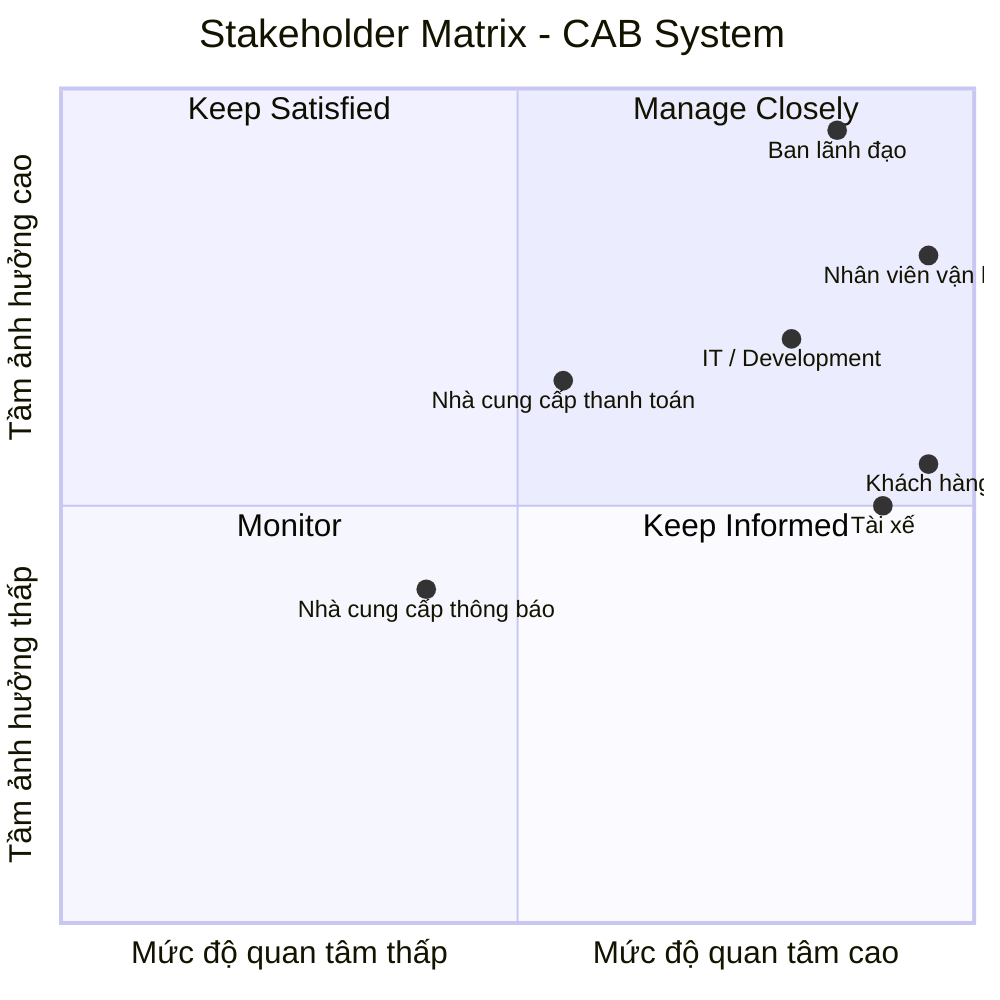

# Phân tích yêu cầu ban đầu của khách hàng

## 1. Bối cảnh nghiệp vụ

Công ty ABC là doanh nghiệp cung cấp dịch vụ đặt xe trực tuyến. Hiện tại, khách hàng có thể liên hệ với tổng đài hoặc sử dụng một ứng dụng đơn giản để yêu cầu xe. Tuy nhiên, hệ thống hiện tại vẫn còn nhiều hạn chế trong quá trình vận hành.

Việc phân công tài xế chủ yếu được thực hiện thủ công, khách hàng gặp khó khăn trong việc theo dõi trạng thái chuyến đi, thông tin thanh toán chưa được quản lý tập trung và bộ phận vận hành gặp khó khăn khi muốn mở rộng hệ thống.

Trước tình hình đó, ban lãnh đạo Công ty ABC mong muốn xây dựng một nền tảng CAB mới có khả năng phục vụ số lượng lớn khách hàng và tài xế, đồng thời có khả năng phát triển thêm các tính năng trong tương lai.

Hệ thống mới không chỉ được định hướng như một ứng dụng đặt xe đơn thuần mà là một nền tảng hỗ trợ toàn bộ quy trình nghiệp vụ, từ khi khách hàng tạo yêu cầu đặt xe, tìm và phân công tài xế, thực hiện chuyến đi, tính cước, thanh toán, gửi thông báo cho đến đánh giá sau chuyến.

## 2. Khách hàng và nhu cầu kinh doanh

Business Customer của hệ thống là **Công ty ABC**, đơn vị cung cấp dịch vụ đặt xe trực tuyến.

Công ty ABC mong muốn giải quyết các hạn chế đang tồn tại trong hoạt động đặt xe và vận hành hiện tại. Đồng thời, doanh nghiệp muốn xây dựng một nền tảng có khả năng phục vụ quy mô lớn và có thể tiếp tục mở rộng trong tương lai.

Các nhu cầu chính của doanh nghiệp bao gồm:

* Tự động hóa quá trình tìm và phân công tài xế.
* Hỗ trợ khách hàng theo dõi trạng thái chuyến đi.
* Hỗ trợ tính cước và thanh toán.
* Quản lý thông tin và giao dịch tập trung.
* Hỗ trợ nhân viên vận hành quản lý khách hàng, tài xế, phương tiện và chuyến đi.
* Cung cấp dữ liệu phục vụ báo cáo và theo dõi hoạt động kinh doanh.
* Đảm bảo bảo mật, phân quyền và lưu vết các thao tác quan trọng.
* Đảm bảo khả năng mở rộng khi số lượng người dùng và tải hệ thống tăng.
* Cho phép bổ sung loại dịch vụ, phương thức thanh toán và nhà cung cấp thông báo trong tương lai.

## 3. Vấn đề nghiệp vụ hiện tại

Qua phân tích yêu cầu ban đầu, có thể xác định các vấn đề chính của doanh nghiệp như sau.

### 3.1. Phân công tài xế còn phụ thuộc vào thao tác thủ công

Việc phân công tài xế hiện chủ yếu được thực hiện thủ công. Khi số lượng khách hàng, tài xế và chuyến đi tăng lên, cách thức này sẽ làm tăng khối lượng công việc cho bộ phận vận hành và gây khó khăn trong việc mở rộng quy mô dịch vụ.

Do đó, hệ thống mới cần có khả năng xác định các tài xế phù hợp dựa trên vị trí, trạng thái sẵn sàng và các tiêu chí vận hành khác. Nếu tài xế được đề xuất không phản hồi hoặc từ chối chuyến, hệ thống cần tiếp tục tìm tài xế khác mà không yêu cầu khách hàng tạo lại yêu cầu.

### 3.2. Khách hàng khó theo dõi trạng thái chuyến đi

Hệ thống hiện tại chưa đáp ứng tốt nhu cầu theo dõi chuyến của khách hàng.

Khách hàng cần biết hệ thống đang tìm tài xế, tài xế nào đã nhận chuyến, thời gian dự kiến tài xế đến và trạng thái hiện tại của chuyến. Trong quá trình thực hiện chuyến, trạng thái cần được cập nhật từ lúc tài xế đến điểm đón, đón khách, đang di chuyển cho đến khi hoàn thành chuyến.

### 3.3. Thanh toán chưa được quản lý tập trung

Thông tin thanh toán hiện chưa được quản lý tập trung. Hệ thống mới cần hỗ trợ tính cước dựa trên loại dịch vụ và thông tin chuyến đi, đồng thời hỗ trợ cả thanh toán tiền mặt và thanh toán điện tử.

Doanh nghiệp muốn tích hợp với nhà cung cấp thanh toán bên ngoài và không muốn lưu trực tiếp thông tin nhạy cảm của thẻ hoặc tài khoản thanh toán trong hệ thống CAB. Hệ thống cũng cần có cơ chế thông báo và xử lý lại khi giao dịch thanh toán điện tử thất bại.

### 3.4. Hệ thống hiện tại khó mở rộng

Doanh nghiệp muốn phục vụ số lượng lớn khách hàng và tài xế, đồng thời tiếp tục phát triển các dịch vụ trong tương lai. Vì vậy, hệ thống cần có khả năng mở rộng độc lập khi tải tăng và cho phép triển khai từng phần mà hạn chế ảnh hưởng đến các chức năng đang hoạt động.

Ngoài ra, hệ thống cần đủ linh hoạt để có thể bổ sung loại dịch vụ mới, phương thức thanh toán mới, nhà cung cấp thông báo mới hoặc thay đổi một số thành phần kỹ thuật mà không phải xây dựng lại toàn bộ ứng dụng.

## 4. Lý do cần xây dựng hệ thống mới

Hệ thống hiện tại không còn đáp ứng đầy đủ nhu cầu vận hành và định hướng phát triển của Công ty ABC.

Khoảng cách giữa khả năng hiện tại và nhu cầu của doanh nghiệp thể hiện ở các vấn đề:

| Hiện trạng                         | Hạn chế                                                 | Ảnh hưởng                               |
| ---------------------------------- | ------------------------------------------------------- | --------------------------------------- |
| Phân công tài xế chủ yếu thủ công  | Chưa có cơ chế tự động tìm và phân công tài xế          | Tăng khối lượng vận hành và khó mở rộng |
| Khách hàng khó theo dõi chuyến     | Thiếu khả năng theo dõi trạng thái chuyến               | Ảnh hưởng trải nghiệm khách hàng        |
| Thanh toán chưa tập trung          | Chưa có quy trình quản lý thanh toán thống nhất         | Khó kiểm soát giao dịch                 |
| Hệ thống khó mở rộng               | Chưa đáp ứng tốt nhu cầu tăng tải và phát triển lâu dài | Hạn chế khả năng mở rộng                |
| Khả năng mở rộng thông báo hạn chế | Cần hỗ trợ nhiều nhà cung cấp/kênh thông báo            | Khó phát triển trong tương lai          |

Vì vậy, việc xây dựng hệ thống mới không chỉ nhằm thay thế ứng dụng hiện tại mà nhằm tạo ra một **nền tảng CAB có khả năng hỗ trợ toàn bộ quy trình đặt xe, nâng cao hiệu quả vận hành và đáp ứng định hướng phát triển lâu dài của doanh nghiệp**.

## 5. Mục tiêu nghiệp vụ

Hệ thống CAB mới hướng tới các mục tiêu:

* Tự động hóa quá trình tìm và phân công tài xế.
* Nâng cao khả năng theo dõi chuyến đi của khách hàng.
* Hỗ trợ tính cước và thanh toán.
* Hỗ trợ quản lý tập trung khách hàng, tài xế, phương tiện và chuyến đi.
* Hỗ trợ nhân viên vận hành xử lý các trường hợp phát sinh.
* Cung cấp báo cáo phục vụ quản lý và ra quyết định.
* Đảm bảo bảo mật, phân quyền và lưu vết thao tác.
* Đảm bảo khả năng mở rộng khi hệ thống tăng tải.
* Tạo nền tảng để bổ sung các dịch vụ và tích hợp mới trong tương lai.

## 6. Các vấn đề cần tiếp tục làm rõ

Một số yêu cầu nghiệp vụ hiện chưa được khách hàng chốt và cần Business Analyst làm rõ với các bên liên quan trước khi nhóm phát triển triển khai.

Các vấn đề gồm:

* Cách tính cước.
* Tiêu chí ưu tiên và lựa chọn tài xế.
* Thời gian tài xế phải phản hồi yêu cầu.
* Chính sách hủy chuyến.
* Cách xử lý khi mất kết nối mạng.
* Thời gian lưu trữ dữ liệu.

Các nội dung trên không nên được BA tự giả định mà cần được xác nhận với stakeholder nghiệp vụ.
# Xác định Stakeholder

## 1. Danh sách Stakeholder

| Tên Stakeholder                | Vai trò                                                                                                                                                                    |
| ------------------------------ | -------------------------------------------------------------------------------------------------------------------------------------------------------------------------- |
| Ban lãnh đạo Công ty ABC       | Định hướng và quyết định mục tiêu kinh doanh của hệ thống; theo dõi báo cáo về số lượng chuyến, doanh thu, tỷ lệ hoàn thành, tỷ lệ hủy và hiệu quả hoạt động của tài xế.   |
| Khách hàng                     | Người sử dụng dịch vụ đặt xe; đăng ký tài khoản, đặt xe, theo dõi chuyến đi, xem lịch sử, thanh toán và đánh giá tài xế.                                                   |
| Tài xế                         | Người thực hiện dịch vụ vận chuyển; quản lý hồ sơ và phương tiện, nhận hoặc từ chối chuyến, cập nhật trạng thái chuyến và cung cấp thông tin vị trí.                       |
| Nhân viên vận hành             | Quản lý và hỗ trợ hoạt động đặt xe; quản lý khách hàng, tài xế, phương tiện và chuyến đi; theo dõi chuyến đang diễn ra, xử lý trường hợp lỗi và tra cứu lịch sử giao dịch. |
| Nhà cung cấp thanh toán        | Cung cấp dịch vụ thanh toán điện tử và xử lý giao dịch thanh toán thông qua hệ thống bên ngoài.                                                                            |
| Nhà cung cấp dịch vụ thông báo | Cung cấp các kênh gửi thông báo đến khách hàng và tài xế, đồng thời hỗ trợ khả năng mở rộng thêm các kênh thông báo trong tương lai.                                       |
| Đội ngũ IT / Development       | Xây dựng, triển khai, bảo trì và đảm bảo hệ thống đáp ứng các yêu cầu về khả năng mở rộng, bảo mật và tích hợp.                                                            |

Các stakeholder trên được xác định dựa trên các nhóm người dùng, yêu cầu vận hành, yêu cầu báo cáo, thanh toán, thông báo và yêu cầu kỹ thuật được nêu trong tài liệu khách hàng.

## 2. Stakeholder Matrix

Ma trận Stakeholder được xây dựng dựa trên hai tiêu chí:

* **Power:** Mức độ ảnh hưởng của stakeholder đến quyết định, phạm vi và hướng phát triển của hệ thống.
* **Interest:** Mức độ quan tâm của stakeholder đối với hệ thống và kết quả của dự án.

## 3. Phân loại Stakeholder

### Manage Closely – Tầm ảnh hưởng cao, mức độ quan tâm cao

* Ban lãnh đạo.
* Nhân viên vận hành.
* Đội ngũ IT / Development.

Đây là các stakeholder cần được trao đổi thường xuyên vì có ảnh hưởng lớn đến mục tiêu kinh doanh, hoạt động vận hành và việc triển khai hệ thống.

### Keep Satisfied – Tầm ảnh hưởng cao, mức độ quan tâm tương đối

* Nhà cung cấp thanh toán.

Stakeholder này có ảnh hưởng trực tiếp đến khả năng thanh toán điện tử của hệ thống và cần được phối hợp trong quá trình tích hợp.

### Keep Informed – Tầm ảnh hưởng thấp hơn, mức độ quan tâm cao

* Khách hàng.
* Tài xế.

Đây là các nhóm sử dụng dịch vụ và hệ thống trực tiếp, do đó cần thường xuyên thu thập phản hồi để đảm bảo hệ thống đáp ứng đúng nhu cầu thực tế.

### Monitor – Tầm ảnh hưởng và mức độ quan tâm tương đối thấp

* Nhà cung cấp dịch vụ thông báo.

Stakeholder này cần được theo dõi và đảm bảo khả năng tích hợp linh hoạt, vì doanh nghiệp mong muốn có thể bổ sung hoặc thay đổi nhà cung cấp thông báo trong tương lai.
