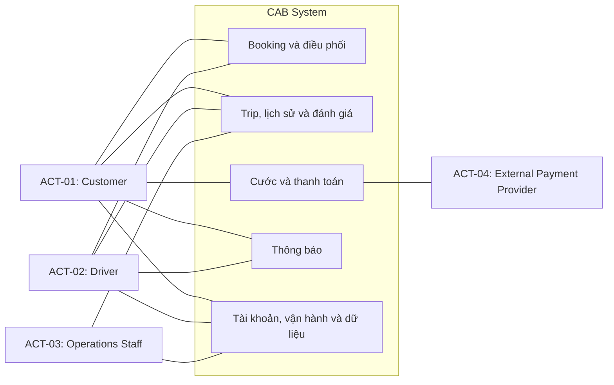
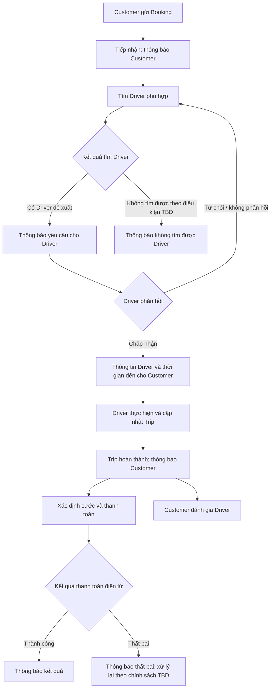
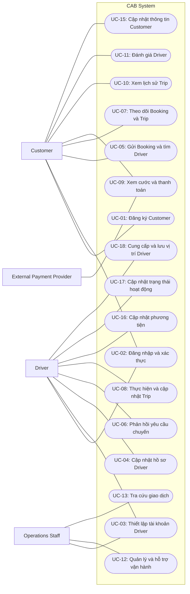

# CAB SYSTEM

## Software Requirements Specification

**Hệ thống đặt xe — Công ty ABC**

| Thuộc tính | Nội dung |
| --- | --- |
| Mã tài liệu | CAB-SRS |
| Tên file | srs.md |
| Phiên bản | 1.4 |
| Trạng thái | Dự thảo để xem xét — Chưa phê duyệt |
| Ngày cập nhật | 26/09/2026 |
| Đơn vị sử dụng | Công ty ABC |
| Đối tượng đọc | Stakeholder, nhóm thiết kế, nhóm phát triển, nhóm kiểm thử, bộ phận vận hành |
| Thời gian xây dựng và triển khai | 7 tuần |
| Initial Release Scope | TBD — OI-11 |

## Mục lục

1. [Quản lý tài liệu](#s0)
2. [Giới thiệu](#s1)
3. [Bối cảnh nghiệp vụ và phạm vi](#s2)
4. [Yêu cầu nghiệp vụ](#s3)
5. [Quy trình nghiệp vụ](#s4)
6. [Quy tắc nghiệp vụ](#s5)
7. [Yêu cầu chức năng](#s6)
8. [Mô hình trạng thái](#s7)
9. [Use case và ngoại lệ](#s8)
10. [Thông tin và dữ liệu nghiệp vụ](#s9)
11. [Yêu cầu giao tiếp bên ngoài](#s10)
12. [Yêu cầu phi chức năng](#s11)
13. [Tiêu chí chấp nhận](#s12)
14. [Các vấn đề cần xác nhận](#s13)
15. [Ma trận truy vết yêu cầu](#s14)
16. [Rủi ro liên quan đến yêu cầu](#s15)
17. [Phụ lục tham chiếu nguồn](#appendix-a)

---

# 0. Quản lý tài liệu

## 0.1. Lịch sử phiên bản

| Phiên bản | Ngày | Nội dung |
| --- | --- | --- |
| 1.0 | 26/09/2026 | Dự thảo thông tin tài liệu, bối cảnh, phạm vi và yêu cầu nghiệp vụ. |
| 1.1 | 26/09/2026 | Đặc tả tổng thể yêu cầu chức năng, quy tắc, quy trình, trạng thái, use case, ngoại lệ, dữ liệu, giao tiếp, chất lượng, tiêu chí chấp nhận và truy vết. |
| 1.2 | 26/09/2026 | Làm rõ căn cứ điều kiện đánh giá; tách mục tiêu use case tài khoản và Driver; bổ sung kiểm chứng lưu vị trí và đồng bộ truy vết. |
| 1.3 | 26/09/2026 | Hiệu chỉnh nguồn giao tiếp thanh toán; làm rõ nghiệp vụ sau khi Trip hoàn thành và phạm vi danh mục actor. |
| 1.4 | 26/09/2026 | Tách danh mục rủi ro khỏi Open Issue; tinh gọn tiêu chí chấp nhận và làm rõ điều kiện tiên quyết. |

## 0.2. Nguồn và tài liệu tham chiếu

| Tài liệu | Vai trò |
| --- | --- |
| Customer-Requirement.docx | Nguồn yêu cầu có thẩm quyền. Các vị trí P001–P014 được định nghĩa tại Phụ lục A. |
| Thiết Kế Micro-Service (1).docx | Tài liệu tham khảo của giai đoạn thiết kế microservice; không phải nguồn yêu cầu SRS. |
| [srs.md trong kho dự án — bản cũ](https://github.com/anhviplay/23637151_NguyenTuanAnh_CABSYSTEMS/blob/main/srs.md) |Tái cấu trúc lại dữ liệu repository |

Quan hệ tài liệu: **Customer Requirement → SRS → Microservice Design → API Specification → Test Case → Code**.

## 0.3. Thuật ngữ

| Thuật ngữ | Định nghĩa |
| --- | --- |
| CAB System | Hệ thống/nền tảng đặt xe của Công ty ABC. |
| Customer | Người sử dụng dịch vụ đặt xe. |
| Driver | Tài xế nhận và thực hiện chuyến. |
| Operations Staff | Nhân viên quản trị và vận hành của ABC. |
| External Payment Provider | Hệ thống bên ngoài xử lý thanh toán điện tử. |
| Booking | Yêu cầu đặt xe của Customer, chứa thông tin phục vụ tìm và phân công Driver. |
| Trip | Chuyến đi cung cấp dịch vụ vận chuyển cho Customer. |
| Product Scope | Phạm vi năng lực của sản phẩm. |
| Initial Release Scope | Tập yêu cầu được lựa chọn cho lần triển khai đầu tiên. |
| TBD | Nội dung đang chờ xác định hoặc xác nhận. |

## 0.4. Quy ước định danh và trạng thái

Mã định danh có dạng `<PREFIX>-<NN>` và duy nhất trong từng loại.

| Prefix | Loại đối tượng | Prefix | Loại đối tượng |
| --- | --- | --- | --- |
| BG | Business Goal | BR | Business Requirement |
| FR | Functional Requirement | NFR | Non-Functional Requirement |
| BRULE | Business Rule | ACT | Actor |
| UC | Use Case | EX | Exception |
| EIR | External Interface Requirement | AC | Acceptance Criterion |
| RTM | Requirements Traceability Matrix | CON | Constraint |
| RISK | Risk | — | — |
| OI | Open Issue | | |

| Phân loại | Ý nghĩa |
| --- | --- |
| Source-derived | Yêu cầu được đặc tả từ nội dung nguồn. |
| Derived Requirement | Yêu cầu suy ra có căn cứ; cần xác nhận phần suy ra. |
| Assumption | Giả định chưa được xác nhận. |
| Proposal | Phương án đề xuất, chưa được phê duyệt. |
| TBD / Open Issue | Nội dung chưa có quyết định hoặc thiếu dữ kiện. |
| Invalid | Nội dung không đủ căn cứ hoặc mâu thuẫn với nguồn; không thuộc tập yêu cầu áp dụng. |

BG, BR, BRULE, FR, NFR, EIR và CON trong các bảng yêu cầu có phân loại **Source-derived**, trừ mục có nhãn khác. Mô hình chuyển trạng thái tại §7.2 và quan hệ khái niệm tại §9.2 có nhãn **Proposal**. Các mục OI có trạng thái **Chờ xác nhận**. Toàn bộ tài liệu có trạng thái **Dự thảo**; nhãn Source-derived không thay thế việc phê duyệt SRS.

# 1. Giới thiệu

## 1.1. Mục đích

Tài liệu đặc tả yêu cầu của CAB System, làm cơ sở thống nhất phạm vi và hành vi hệ thống giữa ABC, nhóm thiết kế, nhóm phát triển và nhóm kiểm thử. Các yêu cầu được liên kết với nguồn, quy tắc nghiệp vụ, kịch bản sử dụng và tiêu chí chấp nhận.

## 1.2. Tổng quan sản phẩm

CAB System hỗ trợ Customer gửi Booking, tìm và phân công Driver, thực hiện Trip, xác định cước, thanh toán, xem lịch sử và đánh giá Driver. Operations Staff quản lý dữ liệu, theo dõi hoạt động và hỗ trợ xử lý Trip lỗi. External Payment Provider xử lý thanh toán điện tử.

Thông báo được cung cấp tại các mốc tiếp nhận Booking, Driver nhận chuyến, đến điểm đón, Trip hoàn thành và thanh toán có kết quả. Driver nhận thông báo chuyến mới và thay đổi liên quan đến Trip đang thực hiện.

## 1.3. Phạm vi tài liệu

SRS bao gồm yêu cầu nghiệp vụ, chức năng, quy tắc, quy trình, trạng thái, use case, ngoại lệ, dữ liệu, giao tiếp bên ngoài, chất lượng và tiêu chí chấp nhận. Phân chia microservice, API endpoint, schema lưu trữ, công nghệ và cấu hình triển khai thuộc tài liệu thiết kế.

Các chính sách chưa được xác định được quản lý tại §13. Tiêu chí chấp nhận phụ thuộc các chính sách đó có điều kiện xác nhận tương ứng tại §12.

# 2. Bối cảnh nghiệp vụ và phạm vi

## 2.1. Bối cảnh nghiệp vụ

ABC hiện tiếp nhận yêu cầu đặt xe qua tổng đài hoặc một ứng dụng đơn giản. Việc phân công Driver chủ yếu thủ công; Customer khó theo dõi trạng thái Trip; thông tin thanh toán chưa được quản lý tập trung; bộ phận vận hành gặp khó khăn khi mở rộng hệ thống. ABC cần một nền tảng phục vụ số lượng lớn Customer và Driver, đồng thời có khả năng phát triển chức năng trong tương lai. Nguồn: P003.

| Hiện trạng | Nhu cầu nghiệp vụ | Mục tiêu |
| --- | --- | --- |
| Phân công Driver chủ yếu thủ công | Hỗ trợ tìm và phân công Driver; tiếp tục tìm khi Driver từ chối hoặc không phản hồi | BG-01 |
| Customer khó theo dõi Trip | Cung cấp tình trạng Booking, Driver nhận chuyến, thời gian dự kiến đến và trạng thái Trip | BG-02 |
| Thông tin thanh toán chưa tập trung; khó theo dõi hoạt động | Quản lý thông tin vận hành, giao dịch và báo cáo | BG-03 |
| Khó mở rộng quy mô | Ổn định khi tải tăng và mở rộng thành phần độc lập | BG-04 |
| Nhu cầu phát triển chức năng tương lai | Bổ sung dịch vụ, phương thức thanh toán, kênh thông báo và thay đổi thành phần | BG-05 |

## 2.2. Mục tiêu nghiệp vụ

| ID | Mục tiêu | Nguồn |
| --- | --- | --- |
| BG-01 | Cải thiện điều phối dịch vụ và phối hợp giữa Customer, Driver và Operations Staff. | P003, P006, P014 |
| BG-02 | Cải thiện khả năng Customer theo dõi xử lý Booking và tiến trình Trip. | P003, P004, P008 |
| BG-03 | Tập trung thông tin Customer, Driver, phương tiện, Trip và giao dịch phục vụ vận hành và quản lý. | P003, P009, P014 |
| BG-04 | Hỗ trợ tăng trưởng sử dụng và duy trì hoạt động ổn định khi nhu cầu tăng cao. | P003, P010 |
| BG-05 | Hỗ trợ phát triển nền tảng với ảnh hưởng hạn chế đến chức năng đang hoạt động. | P008, P010, P012 |

## 2.3. Các bên liên quan

| Stakeholder | Vai trò và nhu cầu | Nguồn |
| --- | --- | --- |
| Công ty ABC / Ban lãnh đạo | Sở hữu nhu cầu nghiệp vụ; theo dõi báo cáo và hiệu quả hoạt động | P003, P009 |
| Customer | Đặt xe, theo dõi Trip, thanh toán, lịch sử và đánh giá Driver | P004 |
| Driver | Quản lý hồ sơ, phương tiện, sẵn sàng làm việc; nhận và thực hiện Trip | P005 |
| Operations Staff | Quản trị dữ liệu, theo dõi và hỗ trợ vận hành | P009 |
| External Payment Provider | Cung cấp xử lý thanh toán điện tử tích hợp | P007 |

Nhóm thiết kế, phát triển và kiểm thử sử dụng SRS làm đầu vào triển khai và xác minh yêu cầu. Cách Ban lãnh đạo truy cập báo cáo: TBD — OI-09.

## 2.4. Tác nhân hệ thống

| ID | Actor | Loại | Tương tác |
| --- | --- | --- | --- |
| ACT-01 | Customer | Primary | Quản lý tài khoản, gửi Booking, theo dõi Trip, thanh toán, lịch sử và đánh giá |
| ACT-02 | Driver | Primary | Quản lý hồ sơ/phương tiện, trạng thái hoạt động, phản hồi và thực hiện Trip |
| ACT-03 | Operations Staff | Primary | Quản trị, giám sát, hỗ trợ Trip lỗi và tra cứu giao dịch |
| ACT-04 | External Payment Provider | Supporting | Xử lý thanh toán điện tử và cung cấp kết quả |

Nguồn: P004–P007, P009. Actor truy cập báo cáo và nhà cung cấp thông báo cụ thể: TBD — OI-09, OI-12.

P004 xác định ít nhất ba nhóm người dùng chính: Customer, Driver và Operations Staff. Danh mục trên thể hiện các actor đã được xác định từ nguồn, không quy định số lượng actor tối đa. External Payment Provider là hệ thống bên ngoài hỗ trợ thanh toán, không phải nhóm người dùng thứ tư. Việc bổ sung actor khác cần được xác nhận về vai trò và phạm vi tương tác.

## 2.5. Phạm vi sản phẩm

| Nhóm năng lực | Phạm vi | BR |
| --- | --- | --- |
| Tài khoản Customer | Đăng ký, đăng nhập, cập nhật thông tin | BR-01 |
| Driver và phương tiện | Đăng ký/tạo tài khoản, hồ sơ, phương tiện, trạng thái hoạt động và sẵn sàng | BR-02 |
| Booking | Điểm đón, điểm đến, loại xe và gửi yêu cầu | BR-03 |
| Điều phối | Vị trí, xác định/ưu tiên Driver, tiếp tục tìm và thông báo không tìm được Driver | BR-04, BR-05 |
| Thực hiện Trip | Driver nhận/từ chối và cập nhật các mốc thực hiện Trip | BR-06 |
| Thông tin Customer | Tình trạng Booking, Driver, thời gian đến, trạng thái Trip, lịch sử và số tiền | BR-07 |
| Cước và thanh toán | Xác định cước; tiền mặt, điện tử, kết quả và xử lý thất bại | BR-08, BR-09 |
| Thông báo | Các mốc nghiệp vụ cho Customer và Driver | BR-10 |
| Đánh giá | Customer đánh giá Driver sau Trip hoàn thành | BR-11 |
| Vận hành | Quản lý dữ liệu, giám sát, hỗ trợ Trip lỗi, tra cứu giao dịch | BR-12, BR-13 |
| Báo cáo | Số Trip, doanh thu, tỷ lệ hoàn thành/hủy, hiệu quả Driver | BR-14 |
| Chất lượng nền tảng | Ổn định, cô lập lỗi, mở rộng độc lập, triển khai từng phần, phát triển tương lai | BR-15–BR-17 |
| Bảo mật và kiểm tra | Xác thực, phân quyền, bảo vệ dữ liệu và lưu vết | BR-18–BR-21 |

## 2.6. Ranh giới hệ thống

```mermaid
flowchart LR
    C["ACT-01: Customer"]
    D["ACT-02: Driver"]
    O["ACT-03: Operations Staff"]
    P["ACT-04: External Payment Provider"]
    subgraph CAB["CAB System"]
        B["Booking và điều phối"]
        T["Trip, lịch sử và đánh giá"]
        M["Cước và thanh toán"]
        N["Thông báo"]
        A["Tài khoản, vận hành và dữ liệu"]
    end
    C --- B
    C --- T
    C --- M
    C --- N
    C --- A
    D --- B
    D --- T
    D --- N
    D --- A
    O --- A
    O --- T
    M --- P
```

Xử lý giao dịch tại External Payment Provider nằm ngoài CAB System. Giao tiếp với nhà cung cấp, tiếp nhận kết quả và thông báo kết quả thuộc CAB System. Nhà cung cấp/kênh thông báo cụ thể được xác nhận tại OI-12.

## 2.7. Ràng buộc

| ID | Ràng buộc | Nguồn |
| --- | --- | --- |
| CON-01 | Thời gian xây dựng và triển khai sản phẩm là 7 tuần. | P002 |
| CON-02 | Không lưu trực tiếp thông tin nhạy cảm của thẻ hoặc tài khoản thanh toán trong CAB System. | P007 |
| CON-03 | Customer và Driver phải được xác thực trước khi sử dụng chức năng yêu cầu tài khoản. | P011 |
| CON-04 | Các thao tác quản trị phải được kiểm soát quyền truy cập. | P009, P011 |
| CON-05 | Thông tin cá nhân, phương tiện, vị trí và giao dịch phải được bảo vệ. | P011 |
| CON-06 | Các thao tác quan trọng phải được lưu vết phục vụ kiểm tra sự cố. | P011 |

## 2.8. Phạm vi phát hành, giả định và phụ thuộc

**Initial Release Scope: TBD — OI-11.** Product Scope tại §2.5 và phạm vi lần triển khai đầu tiên được quản lý riêng. Mốc bắt đầu thời hạn 7 tuần: TBD.

| Nội dung | Trạng thái / phụ thuộc |
| --- | --- |
| Giả định nghiệp vụ áp dụng | Không có giả định được dùng làm yêu cầu đã xác nhận. |
| Chính sách nghiệp vụ | Cước, ưu tiên Driver, phản hồi, hủy, mất kết nối và lưu trữ chờ xác nhận tại OI-01–OI-06. |
| Thanh toán điện tử | Phụ thuộc nhà cung cấp và hợp đồng giao tiếp được lựa chọn — OI-17. |
| Vị trí và ước tính thời gian đến | Phụ thuộc nguồn dữ liệu và phương pháp được xác nhận — OI-19. |
| Kênh thông báo | Phụ thuộc kênh/nhà cung cấp được xác nhận — OI-12. |
| Tiêu chí nghiệm thu định lượng | Phụ thuộc mục tiêu chất lượng và định nghĩa chỉ số — OI-09, OI-13. |

# 3. Yêu cầu nghiệp vụ

| ID | Yêu cầu nghiệp vụ | Mục tiêu / nhu cầu | Nguồn |
| --- | --- | --- | --- |
| BR-01 | **Tài khoản Customer** — CAB System phải hỗ trợ Customer thiết lập và sử dụng tài khoản cho dịch vụ đặt xe, gồm đăng ký, đăng nhập và cập nhật thông tin cá nhân. | BG-01, BG-03 | P004 |
| BR-02 | **Driver và phương tiện** — CAB System phải hỗ trợ quản lý thông tin và khả năng sẵn sàng cung cấp dịch vụ của Driver, gồm Driver tự đăng ký hoặc được Operations Staff tạo tài khoản, cập nhật hồ sơ, phương tiện và trạng thái hoạt động/sẵn sàng nhận chuyến. | BG-01, BG-03 | P005 |
| BR-03 | **Gửi Booking** — CAB System phải cho phép Customer gửi Booking với điểm đón, điểm đến và loại xe đã lựa chọn. | BG-01 | P004 |
| BR-04 | **Tìm Driver phù hợp** — CAB System phải hỗ trợ tìm và phân công Driver dựa trên vị trí, trạng thái sẵn sàng và tiêu chí vận hành, với định hướng ưu tiên Driver phù hợp và gần Customer. Vị trí Driver phải được lưu để hỗ trợ tìm Driver và cải thiện ước tính thời gian đến. | BG-01 | P005–P006 |
| BR-05 | **Duy trì tìm Driver và cung cấp kết quả** — CAB System phải tiếp tục tìm Driver khác cho cùng Booking khi Driver được đề xuất từ chối hoặc không phản hồi, không yêu cầu Customer tạo lại Booking; khi không tìm được Driver, Customer phải được thông báo rõ ràng. | BG-01 | P006 |
| BR-06 | **Tiếp nhận và thực hiện Trip** — CAB System phải hỗ trợ Driver chấp nhận hoặc từ chối yêu cầu chuyến và cập nhật tiến trình thực hiện Trip, gồm đã đến điểm đón, đã đón khách, đang di chuyển và hoàn thành Trip. | BG-01 | P005 |
| BR-07 | **Theo dõi và lịch sử cho Customer** — CAB System phải cung cấp cho Customer thông tin đang tìm Driver, Driver đã nhận chuyến, thời gian dự kiến Driver đến, trạng thái hiện tại của Trip, lịch sử Trip và số tiền phải trả. | BG-02, BG-03 | P004 |
| BR-08 | **Xác định cước** — CAB System phải xác định số tiền Customer phải trả sau khi Trip hoàn thành dựa trên loại dịch vụ và thông tin Trip. | BG-01 | P007 |
| BR-09 | **Thanh toán** — CAB System phải hỗ trợ Customer thanh toán bằng tiền mặt hoặc thanh toán điện tử qua External Payment Provider; khi giao dịch điện tử thất bại, phải thông báo cho Customer và cho phép xử lý lại theo chính sách ABC. | BG-01, BG-03 | P007 |
| BR-10 | **Thông báo nghiệp vụ** — CAB System phải thông báo cho Customer khi Booking được tiếp nhận, Driver nhận chuyến, Driver đến điểm đón, Trip hoàn thành và thanh toán có kết quả; phải thông báo cho Driver về chuyến mới và thay đổi liên quan đến Trip đang thực hiện. | BG-01, BG-02 | P008 |
| BR-11 | **Đánh giá Driver** — CAB System phải cho phép Customer đánh giá Driver sau khi Trip hoàn thành. | phản hồi của Customer sau Trip | P004 |
| BR-12 | **Quản lý và hỗ trợ vận hành** — CAB System phải cung cấp giao diện quản trị cho Operations Staff quản lý Customer, Driver, phương tiện và Trip; theo dõi Trip đang diễn ra, kiểm tra trạng thái Driver và hỗ trợ xử lý Trip lỗi. | BG-01, BG-03 | P009 |
| BR-13 | **Tra cứu giao dịch** — CAB System phải cho phép Operations Staff tra cứu lịch sử giao dịch phục vụ vận hành. | BG-03 | P009 |
| BR-14 | **Báo cáo hoạt động** — CAB System phải cung cấp báo cáo về số lượng Trip, doanh thu, tỷ lệ Trip hoàn thành, tỷ lệ hủy và hiệu quả hoạt động Driver để phục vụ theo dõi hoạt động của ABC. | BG-03 | P009, P014 |
| BR-15 | **Duy trì dịch vụ đặt xe** — CAB System phải hoạt động ổn định khi nhu cầu tăng cao; lỗi tại chức năng thanh toán hoặc thông báo không được làm toàn bộ hệ thống đặt xe ngừng hoạt động. | BG-04 | P010 |
| BR-16 | **Mở rộng độc lập** — Các thành phần CAB System phải có khả năng mở rộng độc lập khi tải tăng, phục vụ nhu cầu tăng trưởng của nền tảng. | BG-04 | P003, P010 |
| BR-17 | **Phát triển nền tảng** — CAB System phải hỗ trợ triển khai chức năng mới từng phần với ảnh hưởng hạn chế đến chức năng đang hoạt động; cho phép bổ sung loại dịch vụ, phương thức thanh toán, kênh/nhà cung cấp thông báo hoặc thay đổi thành phần kỹ thuật mà không xây dựng lại toàn bộ ứng dụng. | BG-05 | P008, P010, P012 |
| BR-18 | **Xác thực tài khoản** — CAB System phải xác thực Customer và Driver trước khi họ sử dụng các chức năng yêu cầu tài khoản. | Kiểm soát danh tính người sử dụng chức năng yêu cầu tài khoản | P011 |
| BR-19 | **Kiểm soát quyền quản trị** — CAB System phải kiểm soát quyền truy cập các thao tác quản trị, bảo đảm nhân viên thông thường không thực hiện được thao tác nhạy cảm ngoài quyền được cấp. | Kiểm soát thao tác quản trị và bảo vệ hoạt động vận hành | P009, P011 |
| BR-20 | **Bảo vệ dữ liệu** — CAB System phải bảo vệ thông tin cá nhân, phương tiện, vị trí và giao dịch; không lưu trực tiếp thông tin nhạy cảm của thẻ hoặc tài khoản thanh toán. | Bảo vệ dữ liệu nghiệp vụ và thông tin thanh toán nhạy cảm | P007, P011 |
| BR-21 | **Lưu vết thao tác** — CAB System phải lưu vết các thao tác quan trọng để phục vụ kiểm tra khi có sự cố. | Có bằng chứng thao tác phục vụ kiểm tra sự cố | P011 |

# 4. Quy trình nghiệp vụ

## 4.1. Luồng dịch vụ tổng thể

| Bước | Chủ thể thực hiện | Hoạt động | Kết quả |
| --- | --- | --- | --- |
| 1 | Customer | Cung cấp điểm đón, điểm đến, loại xe và gửi Booking | Booking được tiếp nhận; Customer nhận thông báo |
| 2 | CAB System | Xác định và ưu tiên Driver theo vị trí, trạng thái sẵn sàng và tiêu chí vận hành | Yêu cầu chuyến được thông báo tới Driver |
| 3 | Driver | Chấp nhận hoặc từ chối | Có Driver nhận chuyến hoặc tiếp tục tìm Driver |
| 4 | CAB System | Cung cấp Driver nhận chuyến và thời gian dự kiến đến | Customer theo dõi được tình trạng phục vụ |
| 5 | Driver | Cập nhật đến điểm đón, đã đón khách, đang di chuyển, hoàn thành | Customer theo dõi tiến trình Trip; nhận thông báo tại các mốc tương ứng |
| 6 | CAB System | Xác định cước sau khi Trip hoàn thành | Có số tiền Customer phải trả |
| 7 | Customer / External Payment Provider | Thanh toán tiền mặt hoặc điện tử | Có kết quả thanh toán; Customer nhận thông báo |
| 8 | Customer | Xem lịch sử và đánh giá Driver sau Trip hoàn thành | Có lịch sử và đánh giá |

Customer Requirement chưa quy định kết quả thanh toán là điều kiện để đánh giá Driver. Operations Staff theo dõi và hỗ trợ vận hành trong quá trình cung cấp dịch vụ. Các hoạt động tự động của CAB System là bước xử lý nội bộ trong quy trình.

## 4.2. Nhánh điều phối và sau Trip

```mermaid
flowchart TD
    A["Customer gửi Booking"] --> B["Tiếp nhận; thông báo Customer"]
    B --> C["Tìm Driver phù hợp"]
    C --> D{"Kết quả tìm Driver"}
    D -->|"Có Driver đề xuất"| E["Thông báo yêu cầu cho Driver"]
    E --> F{"Driver phản hồi"}
    F -->|"Từ chối / không phản hồi"| C
    F -->|"Chấp nhận"| G["Thông tin Driver và thời gian đến cho Customer"]
    D -->|"Không tìm được theo điều kiện TBD"| H["Thông báo không tìm được Driver"]
    G --> I["Driver thực hiện và cập nhật Trip"]
    I --> J["Trip hoàn thành; thông báo Customer"]
    J --> K["Xác định cước và thanh toán"]
    J --> L["Customer đánh giá Driver"]
    K --> M{"Kết quả thanh toán điện tử"}
    M -->|"Thành công"| N["Thông báo kết quả"]
    M -->|"Thất bại"| O["Thông báo thất bại; xử lý lại theo chính sách TBD"]
```

Sơ đồ mô tả nhánh nghiệp vụ từ P004–P008, không xác định thứ tự gửi yêu cầu đến nhiều Driver, số lần tìm, timeout, giới hạn tìm hoặc cơ chế đồng thời. Các điều kiện này thuộc OI-02, OI-03 và OI-14.

# 5. Quy tắc nghiệp vụ

| ID | Quy tắc | BR | Nguồn | Cần xác nhận |
| --- | --- | --- | --- | --- |
| BRULE-01 | Customer và Driver phải được xác thực trước khi sử dụng chức năng yêu cầu tài khoản. | BR-18 | P011 | OI-08, OI-18 |
| BRULE-02 | Thao tác quản trị phải được kiểm soát quyền; nhân viên thông thường không được thực hiện thao tác nhạy cảm ngoài quyền được cấp. | BR-19 | P009, P011 | OI-08 |
| BRULE-03 | Việc tìm Driver dựa trên vị trí, trạng thái sẵn sàng và tiêu chí vận hành; ưu tiên Driver phù hợp và gần Customer. | BR-04 | P006 | OI-02 |
| BRULE-04 | Driver từ chối hoặc không phản hồi không yêu cầu Customer tạo lại Booking; việc tìm Driver khác tiếp tục trên yêu cầu hiện có. | BR-05 | P006 | OI-03 |
| BRULE-05 | Số tiền phải trả được xác định sau khi Trip hoàn thành, dựa trên loại dịch vụ và thông tin Trip. | BR-08 | P007 | OI-01, OI-15 |
| BRULE-06 | Customer được đánh giá Driver sau khi Trip hoàn thành. | BR-11 | P004 | OI-10 |
| BRULE-07 | Thông tin nhạy cảm của thẻ hoặc tài khoản thanh toán không được lưu trực tiếp trong CAB System. | BR-20 | P007 | OI-17 |
| BRULE-08 | Customer được thông báo khi thanh toán điện tử thất bại; xử lý lại thực hiện theo chính sách ABC. | BR-09 | P007 | OI-07 |
| BRULE-09 | Các thao tác quan trọng phải được lưu vết phục vụ kiểm tra sự cố. | BR-21 | P011 | OI-06, OI-16 |

# 6. Yêu cầu chức năng

Các yêu cầu chức năng sử dụng từ “phải” để xác định nghĩa vụ của CAB System. Cột “Cần xác nhận” chỉ các chi tiết chưa có quyết định; nội dung quyết định được quản lý tại §13.

## 6.1. Tài khoản và thông tin Driver

| ID | Yêu cầu | BR | Quy tắc | Cần xác nhận |
| --- | --- | --- | --- | --- |
| FR-01 | CAB System phải cho phép Customer đăng ký tài khoản. | BR-01 | — | OI-18 |
| FR-02 | CAB System phải cho phép Customer đăng nhập tài khoản. | BR-01 | BRULE-01 | OI-18 |
| FR-03 | CAB System phải cho phép Customer cập nhật thông tin cá nhân. | BR-01 | BRULE-01 | OI-18 |
| FR-04 | CAB System phải cho phép Driver tự đăng ký tài khoản. | BR-02 | — | OI-18 |
| FR-05 | CAB System phải cho phép Operations Staff tạo tài khoản Driver. | BR-02 | BRULE-02 | OI-08, OI-18 |
| FR-06 | CAB System phải cho phép Driver cập nhật hồ sơ của mình. | BR-02 | BRULE-01 | OI-18 |
| FR-07 | CAB System phải cho phép Driver cập nhật thông tin phương tiện. | BR-02 | BRULE-01 | OI-18 |
| FR-08 | CAB System phải cho phép Driver cập nhật trạng thái hoạt động. | BR-02 | — | OI-14 |
| FR-09 | CAB System phải cho phép Driver chuyển sang trạng thái sẵn sàng nhận chuyến khi đang làm việc. | BR-02 | BRULE-03 | — |
| FR-10 | CAB System phải lưu thông tin vị trí Driver để hỗ trợ tìm Driver gần Customer và ước tính thời gian đến. | BR-04 | — | OI-06, OI-19 |

## 6.2. Booking và điều phối

| ID | Yêu cầu | BR | Quy tắc | Cần xác nhận |
| --- | --- | --- | --- | --- |
| FR-11 | CAB System phải cho phép Customer nhập điểm đón, điểm đến và lựa chọn loại xe cho Booking. | BR-03 | — | OI-15, OI-18 |
| FR-12 | CAB System phải cho phép Customer gửi Booking để được tìm và phân công Driver. | BR-03 | — | OI-14, OI-18 |
| FR-13 | CAB System phải xác định Driver phù hợp dựa trên vị trí, trạng thái sẵn sàng và các tiêu chí vận hành. | BR-04 | BRULE-03 | OI-02 |
| FR-14 | CAB System phải ưu tiên Driver phù hợp và gần Customer khi tìm Driver. | BR-04 | BRULE-03 | OI-02 |
| FR-15 | CAB System phải thông báo yêu cầu chuyến phù hợp cho Driver. | BR-06, BR-10 | — | OI-12 |
| FR-16 | CAB System phải cho phép Driver chấp nhận yêu cầu chuyến được gửi tới mình. | BR-06 | — | OI-14 |
| FR-17 | CAB System phải cho phép Driver từ chối yêu cầu và tiếp tục tìm Driver khác cho cùng Booking mà không yêu cầu Customer tạo lại Booking. | BR-05, BR-06 | BRULE-04 | — |
| FR-18 | CAB System phải tiếp tục tìm Driver khác khi Driver được đề xuất không phản hồi, không yêu cầu Customer tạo lại Booking. | BR-05 | BRULE-04 | OI-03 |
| FR-19 | CAB System phải thông báo rõ ràng cho Customer khi không tìm được Driver. | BR-05 | — | OI-14 |

## 6.3. Theo dõi và thực hiện Trip

| ID | Yêu cầu | BR | Quy tắc | Cần xác nhận |
| --- | --- | --- | --- | --- |
| FR-20 | CAB System phải cho Customer biết Booking đang được tìm Driver. | BR-07 | — | — |
| FR-21 | CAB System phải cho Customer biết Driver nào đã nhận chuyến. | BR-07 | — | — |
| FR-22 | CAB System phải cung cấp cho Customer thời gian dự kiến Driver đến điểm đón. | BR-07 | — | OI-19 |
| FR-23 | CAB System phải cho Customer theo dõi trạng thái hiện tại của Trip. | BR-07 | — | OI-05, OI-14 |
| FR-24 | CAB System phải cho phép Driver cập nhật đã đến điểm đón. | BR-06 | — | OI-14 |
| FR-25 | CAB System phải cho phép Driver cập nhật đã đón Customer. | BR-06 | — | OI-14 |
| FR-26 | CAB System phải cho phép Driver cập nhật Trip đang di chuyển. | BR-06 | — | OI-14 |
| FR-27 | CAB System phải cho phép Driver cập nhật Trip hoàn thành. | BR-06 | — | OI-14 |

Trip hoàn thành theo FR-27 là sự kiện kích hoạt xác định số tiền phải trả (FR-28, BRULE-05) và đáp ứng điều kiện về trạng thái Trip để Customer đánh giá Driver (FR-42, BRULE-06). Tính cước và đánh giá là các nghiệp vụ sau khi Trip hoàn thành, không phải điều kiện tiên quyết để Driver cập nhật hoàn thành Trip.

## 6.4. Cước và thanh toán

| ID | Yêu cầu | BR | Quy tắc | Cần xác nhận |
| --- | --- | --- | --- | --- |
| FR-28 | CAB System phải xác định số tiền phải trả sau khi Trip hoàn thành dựa trên loại dịch vụ và thông tin Trip. | BR-08 | BRULE-05 | OI-01, OI-15 |
| FR-29 | CAB System phải cho Customer xem số tiền phải trả của Trip. | BR-07 | — | — |
| FR-30 | CAB System phải hỗ trợ Customer thanh toán bằng tiền mặt. | BR-09 | — | OI-17 |
| FR-31 | CAB System phải hỗ trợ Customer thanh toán điện tử qua External Payment Provider. | BR-09 | BRULE-07 | OI-17 |
| FR-32 | CAB System phải tiếp nhận kết quả thanh toán điện tử từ External Payment Provider để cung cấp kết quả cho Customer. | BR-09 | — | OI-17 |
| FR-33 | CAB System phải thông báo cho Customer khi giao dịch thanh toán điện tử thất bại. | BR-09 | BRULE-08 | OI-12 |
| FR-34 | CAB System phải cho phép xử lý lại giao dịch thanh toán điện tử thất bại theo chính sách của ABC. | BR-09 | BRULE-08 | OI-07, OI-17 |

## 6.5. Thông báo

| ID | Yêu cầu | BR | Quy tắc | Cần xác nhận |
| --- | --- | --- | --- | --- |
| FR-35 | CAB System phải thông báo cho Customer khi Booking được tiếp nhận. | BR-10 | — | OI-12 |
| FR-36 | CAB System phải thông báo cho Customer khi có Driver nhận chuyến. | BR-10 | — | OI-12 |
| FR-37 | CAB System phải thông báo cho Customer khi Driver đến điểm đón. | BR-10 | — | OI-12 |
| FR-38 | CAB System phải thông báo cho Customer khi Trip hoàn thành. | BR-10 | — | OI-12 |
| FR-39 | CAB System phải thông báo kết quả thanh toán cho Customer. | BR-10 | — | OI-12, OI-17 |
| FR-40 | CAB System phải thông báo cho Driver về thay đổi liên quan đến Trip đang thực hiện. | BR-10 | — | OI-12 |

## 6.6. Lịch sử và đánh giá

| ID | Yêu cầu | BR | Quy tắc | Cần xác nhận |
| --- | --- | --- | --- | --- |
| FR-41 | CAB System phải cho Customer xem lịch sử Trip. | BR-07 | — | OI-06 |
| FR-42 | CAB System phải cho Customer đánh giá Driver sau khi Trip hoàn thành. | BR-11 | BRULE-06 | OI-10 |

## 6.7. Quản trị và vận hành

| ID | Yêu cầu | BR | Quy tắc | Cần xác nhận |
| --- | --- | --- | --- | --- |
| FR-43 | CAB System phải cung cấp chức năng quản lý Customer cho Operations Staff. | BR-12 | BRULE-02 | OI-08, OI-20 |
| FR-44 | CAB System phải cung cấp chức năng quản lý Driver cho Operations Staff. | BR-12 | BRULE-02 | OI-08, OI-20 |
| FR-45 | CAB System phải cung cấp chức năng quản lý phương tiện cho Operations Staff. | BR-12 | BRULE-02 | OI-08, OI-20 |
| FR-46 | CAB System phải cung cấp chức năng quản lý Trip cho Operations Staff. | BR-12 | BRULE-02 | OI-08, OI-20 |
| FR-47 | CAB System phải cho Operations Staff xem các Trip đang diễn ra. | BR-12 | BRULE-02 | OI-08, OI-14 |
| FR-48 | CAB System phải cho Operations Staff kiểm tra trạng thái Driver. | BR-12 | BRULE-02 | OI-08 |
| FR-49 | CAB System phải hỗ trợ Operations Staff kiểm tra và xử lý các trường hợp Trip lỗi. | BR-12 | BRULE-02 | OI-08, OI-20 |
| FR-50 | CAB System phải cho Operations Staff tra cứu lịch sử giao dịch. | BR-13 | BRULE-02 | OI-06, OI-08, OI-20 |

## 6.8. Báo cáo

| ID | Yêu cầu | BR | Quy tắc | Cần xác nhận |
| --- | --- | --- | --- | --- |
| FR-51 | CAB System phải cung cấp báo cáo số lượng Trip. | BR-14 | — | OI-09 |
| FR-52 | CAB System phải cung cấp báo cáo doanh thu. | BR-14 | — | OI-09 |
| FR-53 | CAB System phải cung cấp báo cáo tỷ lệ Trip hoàn thành. | BR-14 | — | OI-09, OI-14 |
| FR-54 | CAB System phải cung cấp báo cáo tỷ lệ hủy. | BR-14 | — | OI-04, OI-09 |
| FR-55 | CAB System phải cung cấp báo cáo hiệu quả hoạt động của Driver. | BR-14 | — | OI-09 |

## 6.9. Xác thực, phân quyền và lưu vết

| ID | Yêu cầu | BR | Quy tắc | Cần xác nhận |
| --- | --- | --- | --- | --- |
| FR-56 | CAB System phải xác thực Customer và Driver trước khi cho sử dụng chức năng yêu cầu tài khoản. | BR-18 | BRULE-01 | OI-08, OI-18 |
| FR-57 | CAB System phải kiểm soát quyền truy cập thao tác quản trị. | BR-19 | BRULE-02 | OI-08 |
| FR-58 | CAB System phải lưu vết các thao tác quan trọng phục vụ kiểm tra khi có sự cố. | BR-21 | BRULE-09 | OI-06, OI-16 |

# 7. Mô hình trạng thái

## 7.1. Các mốc nghiệp vụ có nguồn

| Đối tượng | Mốc / thông tin trạng thái | Nguồn | FR |
| --- | --- | --- | --- |
| Booking | Được tiếp nhận; đang tìm Driver; có Driver nhận chuyến; không tìm được Driver | P004, P006, P008 | FR-12, FR-19–FR-21, FR-35–FR-36 |
| Phản hồi Driver | Chấp nhận; từ chối; không phản hồi | P005–P006 | FR-16–FR-18 |
| Trip | Đã đến điểm đón; đã đón Customer; đang di chuyển; hoàn thành | P005 | FR-24–FR-27 |
| Driver | Trạng thái hoạt động; sẵn sàng nhận chuyến | P005 | FR-08–FR-09 |
| Thanh toán điện tử | Kết quả thanh toán; thất bại được nêu cụ thể | P007–P008 | FR-32–FR-34, FR-39 |

## 7.2. Mô hình chuyển trạng thái đề xuất

**Phân loại: Proposal — Chờ xác nhận tại OI-14 và OI-17.** Tên trạng thái dưới đây là nhãn nghiệp vụ, không phải mã dữ liệu hoặc API.

| Đối tượng | Từ trạng thái | Sự kiện | Đến trạng thái đề xuất | Điều kiện còn TBD |
| --- | --- | --- | --- | --- |
| Booking | Tiếp nhận | Bắt đầu tìm Driver | Đang tìm Driver | Điều kiện tiếp nhận và thời điểm bắt đầu |
| Booking | Đang tìm Driver | Driver từ chối / không phản hồi | Đang tìm Driver | Timeout, giới hạn tìm và điều kiện dừng |
| Booking | Đang tìm Driver | Driver chấp nhận | Có Driver nhận chuyến | Xử lý chấp nhận đồng thời, phản hồi muộn và quan hệ Booking–Trip |
| Booking | Đang tìm Driver | Kết luận không tìm được Driver | Không tìm được Driver | Phạm vi tìm, số lần tìm và trạng thái kết thúc |
| Trip | Driver đã nhận chuyến | Driver cập nhật đến điểm đón | Đã đến điểm đón | Thời điểm hình thành Trip, quyền cập nhật |
| Trip | Đã đến điểm đón | Driver cập nhật đã đón khách | Đã đón Customer | Quy tắc chuyển trạng thái |
| Trip | Đã đón Customer | Driver cập nhật đang di chuyển | Đang di chuyển | Quy tắc chuyển trạng thái |
| Trip | Đang di chuyển | Driver cập nhật hoàn thành | Hoàn thành | Điều kiện hoàn thành, sửa hoặc đảo trạng thái |
| Thanh toán điện tử | Đang xử lý | Nhận kết quả xác định | Thành công / Thất bại | Tập trạng thái và ánh xạ kết quả nhà cung cấp |
| Thanh toán điện tử | Thất bại | Được phép xử lý lại | Theo chính sách xử lý lại | Điều kiện, số lần, giao dịch mới/cũ và chống xử lý trùng |

## 7.3. Các chuyển tiếp chưa xác định

| Trường hợp | Quyết định cần xác nhận | OI |
| --- | --- | --- |
| Hủy Booking hoặc Trip | Chủ thể được hủy, điều kiện, trạng thái và hệ quả cước/thanh toán | OI-04 |
| Mất kết nối | Trạng thái hiển thị, cập nhật khi offline và xử lý khi kết nối lại | OI-05 |
| Trip lỗi | Trạng thái lỗi, thao tác hỗ trợ và quyền sửa trạng thái | OI-14, OI-20 |
| Driver thay đổi trạng thái hoạt động | Danh sách trạng thái và chuyển tiếp, liên hệ với Trip hiện tại | OI-14 |
| Kết quả thanh toán chưa xác định | Trạng thái chờ, kết quả muộn/trùng và đối soát | OI-17 |
| Quan hệ Booking–Trip | Thời điểm tạo Trip, số lượng Trip tương ứng một Booking và xử lý Booking không thành công | OI-14 |

# 8. Use case và ngoại lệ

## 8.1. Danh mục use case

| ID | Use case | Actor | FR |
| --- | --- | --- | --- |
| UC-01 | Đăng ký Customer | ACT-01 | FR-01 |
| UC-02 | Đăng nhập và xác thực tài khoản | ACT-01; ACT-02 trong luồng xác thực | FR-02, FR-56 |
| UC-03 | Thiết lập tài khoản Driver | ACT-02 hoặc ACT-03 | FR-04, FR-05, FR-57 |
| UC-04 | Cập nhật hồ sơ Driver | ACT-02 | FR-06 |
| UC-05 | Gửi Booking và tìm Driver | ACT-01; ACT-02 tham gia phản hồi qua UC-06 | FR-11, FR-12, FR-13, FR-14, FR-15, FR-16, FR-17, FR-18, FR-19, FR-20, FR-21, FR-35, FR-36 |
| UC-06 | Phản hồi yêu cầu chuyến | ACT-02 | FR-15, FR-16, FR-17, FR-21, FR-36 |
| UC-07 | Theo dõi Booking và Trip | ACT-01 | FR-20, FR-21, FR-22, FR-23, FR-36 |
| UC-08 | Thực hiện và cập nhật Trip | ACT-02; ACT-01 nhận thông tin | FR-23, FR-24, FR-25, FR-26, FR-27, FR-37, FR-38, FR-40 |
| UC-09 | Xem cước và thanh toán | ACT-01; ACT-04 hỗ trợ thanh toán điện tử | FR-28, FR-29, FR-30, FR-31, FR-32, FR-33, FR-34, FR-39 |
| UC-10 | Xem lịch sử Trip | ACT-01 | FR-29, FR-41 |
| UC-11 | Đánh giá Driver | ACT-01 | FR-42 |
| UC-12 | Quản lý và hỗ trợ vận hành | ACT-03 | FR-43, FR-44, FR-45, FR-46, FR-47, FR-48, FR-49, FR-57 |
| UC-13 | Tra cứu giao dịch | ACT-03 | FR-50 |
| UC-14 | Khai thác báo cáo hoạt động | TBD — OI-09; stakeholder nhận thông tin: Ban lãnh đạo ABC | FR-51, FR-52, FR-53, FR-54, FR-55 |
| UC-15 | Cập nhật thông tin Customer | ACT-01 | FR-03 |
| UC-16 | Cập nhật thông tin phương tiện | ACT-02 | FR-07 |
| UC-17 | Cập nhật trạng thái hoạt động Driver | ACT-02 | FR-08, FR-09 |
| UC-18 | Cung cấp và lưu thông tin vị trí Driver | ACT-02 | FR-10 |

## 8.2. Mô hình tương tác

```mermaid
flowchart LR
    C["Customer"]
    D["Driver"]
    O["Operations Staff"]
    P["External Payment Provider"]
    subgraph CAB["CAB System"]
        U1(["UC-01: Đăng ký Customer"])
        U2(["UC-02: Đăng nhập và xác thực"])
        U3(["UC-03: Thiết lập tài khoản Driver"])
        U4(["UC-04: Cập nhật hồ sơ Driver"])
        U5(["UC-05: Gửi Booking và tìm Driver"])
        U6(["UC-06: Phản hồi yêu cầu chuyến"])
        U7(["UC-07: Theo dõi Booking và Trip"])
        U8(["UC-08: Thực hiện và cập nhật Trip"])
        U9(["UC-09: Xem cước và thanh toán"])
        U10(["UC-10: Xem lịch sử Trip"])
        U11(["UC-11: Đánh giá Driver"])
        U12(["UC-12: Quản lý và hỗ trợ vận hành"])
        U13(["UC-13: Tra cứu giao dịch"])
        U15(["UC-15: Cập nhật thông tin Customer"])
        U16(["UC-16: Cập nhật phương tiện"])
        U17(["UC-17: Cập nhật trạng thái hoạt động"])
        U18(["UC-18: Cung cấp và lưu vị trí Driver"])
    end
    C --- U1
    C --- U2
    D --- U2
    D --- U3
    O --- U3
    D --- U4
    C --- U5
    D --- U6
    C --- U7
    D --- U8
    C --- U9
    P --- U9
    C --- U10
    C --- U11
    O --- U12
    O --- U13
    C --- U15
    D --- U16
    D --- U17
    D --- U18
```

UC-14 chờ xác nhận actor truy cập báo cáo tại OI-09. Sơ đồ là bản đồ tương tác, không sử dụng quan hệ UML include/extend.

## 8.3. Đặc tả use case

### UC-01 — Đăng ký Customer

| Thuộc tính | Đặc tả |
| --- | --- |
| Actor | ACT-01 |
| Điều kiện trước | Customer cần tài khoản. |
| Kích hoạt | Customer cung cấp thông tin đăng ký. |
| Kết quả sau | Customer có tài khoản khi đăng ký thành công. |
| FR liên quan | FR-01 |
| Cần xác nhận | OI-18 |

**Luồng chính**

1. Customer gửi thông tin đăng ký.
2. CAB System tiếp nhận theo bộ thông tin và quy tắc đã xác nhận.
3. CAB System cung cấp kết quả đăng ký.

**Luồng thay thế / ngoại lệ:** Dữ liệu thiếu, trùng hoặc không hợp lệ: EX-11; xử lý chi tiết TBD.

### UC-02 — Đăng nhập và xác thực tài khoản

| Thuộc tính | Đặc tả |
| --- | --- |
| Actor | ACT-01; ACT-02 trong luồng xác thực |
| Điều kiện trước | Tài khoản đã được thiết lập; cơ chế xác thực Driver: TBD — OI-18. |
| Kích hoạt | Customer yêu cầu đăng nhập hoặc Driver yêu cầu sử dụng chức năng cần tài khoản. |
| Kết quả sau | Customer đăng nhập thành công; Driver được xác thực khi đáp ứng cơ chế áp dụng. |
| FR liên quan | FR-02, FR-56 |
| Cần xác nhận | OI-08, OI-18 |

**Luồng chính**

1. Customer cung cấp thông tin đăng nhập; Driver cung cấp thông tin xác thực theo cơ chế được xác nhận.
2. CAB System thực hiện xác thực.
3. Khi xác thực thành công, CAB System cho phép tiếp tục truy cập chức năng tài khoản theo quyền áp dụng.

**Luồng thay thế / ngoại lệ:** Tại bước 2, không xác thực được: EX-08; người dùng không được sử dụng chức năng yêu cầu tài khoản. Cách thông báo và cơ chế xác thực chi tiết: OI-18.

### UC-03 — Thiết lập tài khoản Driver

| Thuộc tính | Đặc tả |
| --- | --- |
| Actor | ACT-02 hoặc ACT-03 |
| Điều kiện trước | Operations Staff có quyền khi tạo tài khoản cho Driver. |
| Kích hoạt | Driver đăng ký hoặc Operations Staff yêu cầu tạo tài khoản Driver. |
| Kết quả sau | Tài khoản Driver được tạo khi thao tác thành công. |
| FR liên quan | FR-04, FR-05, FR-57 |
| Cần xác nhận | OI-08, OI-18 |

**Luồng chính**

1. Driver cung cấp thông tin đăng ký; hoặc Operations Staff nhập thông tin tạo tài khoản.
2. CAB System thực hiện đăng ký/tạo tài khoản theo quy tắc dữ liệu đã xác nhận.
3. CAB System cung cấp kết quả.

**Luồng thay thế / ngoại lệ:** Không đủ quyền: EX-09. Dữ liệu không hợp lệ: EX-11.

### UC-04 — Cập nhật hồ sơ Driver

| Thuộc tính | Đặc tả |
| --- | --- |
| Actor | ACT-02 |
| Điều kiện trước | Driver có tài khoản và được xác thực cho chức năng cập nhật hồ sơ. |
| Kích hoạt | Driver yêu cầu cập nhật hồ sơ cá nhân. |
| Kết quả sau | Hồ sơ Driver phản ánh thay đổi được chấp nhận. |
| FR liên quan | FR-06 |
| Cần xác nhận | OI-18 |

**Luồng chính**

1. Driver cung cấp thông tin hồ sơ cần thay đổi.
2. CAB System tiếp nhận thông tin theo các trường và quy tắc dữ liệu được xác nhận.
3. CAB System cập nhật hồ sơ và cung cấp kết quả cho Driver.

**Luồng thay thế / ngoại lệ:** Tại bước 2, dữ liệu thiếu, trùng hoặc không hợp lệ: EX-11; quy tắc xử lý chi tiết thuộc OI-18. Chưa xác thực: EX-08.

### UC-05 — Gửi Booking và tìm Driver

| Thuộc tính | Đặc tả |
| --- | --- |
| Actor | ACT-01; ACT-02 tham gia phản hồi qua UC-06 |
| Điều kiện trước | Customer đáp ứng điều kiện truy cập chức năng theo chính sách tài khoản được xác nhận. |
| Kích hoạt | Customer gửi Booking. |
| Kết quả sau | Booking đã được tiếp nhận và có kết quả tìm Driver; khi thành công, Driver nhận chuyến được xác định. |
| FR liên quan | FR-11, FR-12, FR-13, FR-14, FR-15, FR-16, FR-17, FR-18, FR-19, FR-20, FR-21, FR-35, FR-36 |
| Cần xác nhận | OI-02, OI-03, OI-04, OI-05, OI-14, OI-15, OI-18 |

**Luồng chính**

1. Customer nhập điểm đón, điểm đến và chọn loại xe.
2. CAB System tiếp nhận Booking và thông báo cho Customer.
3. CAB System xác định Driver theo vị trí, sẵn sàng và tiêu chí vận hành; ưu tiên phù hợp và gần.
4. Driver nhận yêu cầu và phản hồi theo UC-06.
5. Khi có Driver nhận chuyến, CAB System cung cấp thông tin Driver và thông báo cho Customer.

**Luồng thay thế / ngoại lệ:** Từ chối: EX-01; không phản hồi: EX-02; không tìm được Driver: EX-03; hủy: EX-06; mất kết nối: EX-07; dữ liệu thiếu: EX-11; phản hồi đồng thời: EX-13.

### UC-06 — Phản hồi yêu cầu chuyến

| Thuộc tính | Đặc tả |
| --- | --- |
| Actor | ACT-02 |
| Điều kiện trước | Có yêu cầu chuyến được gửi đến Driver. |
| Kích hoạt | Driver nhận thông báo yêu cầu chuyến. |
| Kết quả sau | Driver đã nhận chuyến trong luồng chấp nhận thành công. |
| FR liên quan | FR-15, FR-16, FR-17, FR-21, FR-36 |
| Cần xác nhận | OI-03, OI-14 |

**Luồng chính**

1. CAB System thông báo yêu cầu chuyến phù hợp.
2. Driver chấp nhận yêu cầu.
3. CAB System thể hiện Driver đã nhận chuyến cho Customer và gửi thông báo tương ứng.

**Luồng thay thế / ngoại lệ:** Driver từ chối: EX-01; không phản hồi: EX-02; nhiều phản hồi chấp nhận: EX-13.

### UC-07 — Theo dõi Booking và Trip

| Thuộc tính | Đặc tả |
| --- | --- |
| Actor | ACT-01 |
| Điều kiện trước | Customer có Booking/Trip cần theo dõi. |
| Kích hoạt | Customer mở thông tin Booking/Trip. |
| Kết quả sau | Customer xem được thông tin xử lý Booking và tiến trình Trip hiện có. |
| FR liên quan | FR-20, FR-21, FR-22, FR-23, FR-36 |
| Cần xác nhận | OI-05, OI-14, OI-19 |

**Luồng chính**

1. Trong quá trình tìm Driver, CAB System thể hiện đang tìm Driver.
2. Khi Driver nhận chuyến, CAB System cung cấp Driver nhận chuyến và thời gian dự kiến đến.
3. Customer theo dõi trạng thái hiện tại của Trip theo các cập nhật từ Driver.

**Luồng thay thế / ngoại lệ:** Không tìm được Driver: EX-03; mất kết nối: EX-07; thiếu/cũ dữ liệu vị trí: EX-12.

### UC-08 — Thực hiện và cập nhật Trip

| Thuộc tính | Đặc tả |
| --- | --- |
| Actor | ACT-02; ACT-01 nhận thông tin |
| Điều kiện trước | Driver đã nhận chuyến; điều kiện chuyển trạng thái theo OI-14. |
| Kích hoạt | Driver thực hiện Trip và cập nhật tiến trình. |
| Kết quả sau | Tiến trình Trip được cập nhật; khi hoàn thành, các nghiệp vụ cước và đánh giá có điều kiện kích hoạt tương ứng. |
| FR liên quan | FR-23, FR-24, FR-25, FR-26, FR-27, FR-37, FR-38, FR-40 |
| Cần xác nhận | OI-04, OI-05, OI-12, OI-14, OI-20 |

**Luồng chính**

1. Driver cập nhật đã đến điểm đón; CAB System thông báo Customer.
2. Driver cập nhật đã đón Customer.
3. Driver cập nhật đang di chuyển.
4. Driver cập nhật hoàn thành Trip; CAB System thông báo Customer.
5. CAB System cung cấp trạng thái để Customer theo dõi và thông báo Driver về thay đổi liên quan.

**Luồng thay thế / ngoại lệ:** Trip lỗi: EX-05; hủy: EX-06; mất kết nối: EX-07; thông báo lỗi: EX-10; chuyển trạng thái không rõ hợp lệ: EX-15.

Trình tự mô tả luồng thông thường; quy tắc bắt buộc chuyển trạng thái thuộc mô hình đề xuất tại §7.

### UC-09 — Xem cước và thanh toán

| Thuộc tính | Đặc tả |
| --- | --- |
| Actor | ACT-01; ACT-04 hỗ trợ thanh toán điện tử |
| Điều kiện trước | Trip hoàn thành; quy tắc cước và phương thức thanh toán áp dụng đã được xác nhận. |
| Kích hoạt | Customer xem số tiền và thực hiện thanh toán. |
| Kết quả sau | Customer biết số tiền phải trả và kết quả thanh toán khi có kết quả xác định. |
| FR liên quan | FR-28, FR-29, FR-30, FR-31, FR-32, FR-33, FR-34, FR-39 |
| Cần xác nhận | OI-01, OI-07, OI-15, OI-17 |

**Luồng chính**

1. CAB System xác định cước dựa trên loại dịch vụ và thông tin Trip.
2. Customer xem số tiền phải trả.
3. Customer thanh toán tiền mặt theo quy trình xác nhận tiền mặt, hoặc chọn thanh toán điện tử.
4. Với điện tử, CAB System tích hợp External Payment Provider để xử lý và nhận kết quả.
5. CAB System thông báo kết quả thanh toán cho Customer.

**Luồng thay thế / ngoại lệ:** Thanh toán thất bại: EX-04; lỗi chức năng thanh toán: EX-10; chưa có/nhận trùng kết quả: EX-14.

Thanh toán tiền mặt và điện tử là hai luồng lựa chọn; cách xác nhận tiền mặt còn TBD.

### UC-10 — Xem lịch sử Trip

| Thuộc tính | Đặc tả |
| --- | --- |
| Actor | ACT-01 |
| Điều kiện trước | Customer được xác thực theo chính sách tài khoản. |
| Kích hoạt | Customer yêu cầu xem lịch sử. |
| Kết quả sau | Customer xem được lịch sử Trip hiện có. |
| FR liên quan | FR-29, FR-41 |
| Cần xác nhận | OI-06, OI-08 |

**Luồng chính**

1. Customer mở lịch sử Trip.
2. CAB System cung cấp lịch sử Trip và số tiền phải trả tương ứng trong phạm vi dữ liệu lưu trữ.

**Luồng thay thế / ngoại lệ:** Chưa xác thực: EX-08; thời hạn lưu trữ: OI-06.

### UC-11 — Đánh giá Driver

| Thuộc tính | Đặc tả |
| --- | --- |
| Actor | ACT-01 |
| Điều kiện trước | Trip đã hoàn thành. |
| Kích hoạt | Customer gửi đánh giá Driver. |
| Kết quả sau | Đánh giá Driver được ghi nhận. |
| FR liên quan | FR-42 |
| Cần xác nhận | OI-10 |

**Luồng chính**

1. Customer nhập đánh giá theo cấu trúc đã xác nhận.
2. CAB System ghi nhận đánh giá đối với Driver của Trip hoàn thành.

**Luồng thay thế / ngoại lệ:** Đánh giá trước khi Trip hoàn thành: không đáp ứng BRULE-06. Các trường hợp sửa/trùng/quá hạn đánh giá: OI-10.

### UC-12 — Quản lý và hỗ trợ vận hành

| Thuộc tính | Đặc tả |
| --- | --- |
| Actor | ACT-03 |
| Điều kiện trước | Operations Staff có quyền với thao tác được yêu cầu. |
| Kích hoạt | Operations Staff truy cập giao diện quản trị. |
| Kết quả sau | Thông tin vận hành được cung cấp và thao tác được thực hiện trong phạm vi quyền được cấp. |
| FR liên quan | FR-43, FR-44, FR-45, FR-46, FR-47, FR-48, FR-49, FR-57 |
| Cần xác nhận | OI-08, OI-14, OI-20 |

**Luồng chính**

1. Operations Staff chọn quản lý Customer, Driver, phương tiện hoặc Trip.
2. CAB System cung cấp thông tin và thao tác theo quyền.
3. Operations Staff xem Trip đang diễn ra, kiểm tra trạng thái Driver.
4. Với Trip lỗi, Operations Staff thực hiện thao tác hỗ trợ theo quy trình đã xác nhận.

**Luồng thay thế / ngoại lệ:** Thiếu quyền: EX-09; Trip lỗi: EX-05; chuyển trạng thái ngoài quy tắc: EX-15.

### UC-13 — Tra cứu giao dịch

| Thuộc tính | Đặc tả |
| --- | --- |
| Actor | ACT-03 |
| Điều kiện trước | Operations Staff có quyền tra cứu giao dịch. |
| Kích hoạt | Operations Staff yêu cầu tra cứu lịch sử giao dịch. |
| Kết quả sau | Operations Staff xem được giao dịch thuộc phạm vi truy cập. |
| FR liên quan | FR-50 |
| Cần xác nhận | OI-06, OI-08, OI-20 |

**Luồng chính**

1. Operations Staff cung cấp tiêu chí tra cứu đã được xác nhận.
2. CAB System cung cấp lịch sử giao dịch phù hợp, trong thời hạn lưu trữ.

**Luồng thay thế / ngoại lệ:** Thiếu quyền: EX-09; thời hạn lưu dữ liệu: OI-06.

### UC-14 — Khai thác báo cáo hoạt động

| Thuộc tính | Đặc tả |
| --- | --- |
| Actor | TBD — OI-09; stakeholder nhận thông tin: Ban lãnh đạo ABC |
| Điều kiện trước | Định nghĩa chỉ số, kỳ dữ liệu và cách truy cập báo cáo đã xác nhận. |
| Kích hoạt | Yêu cầu cung cấp báo cáo; cơ chế tương tác: TBD. |
| Kết quả sau | Có thông tin báo cáo theo định nghĩa và dữ liệu đã xác nhận. |
| FR liên quan | FR-51, FR-52, FR-53, FR-54, FR-55 |
| Cần xác nhận | OI-04, OI-09, OI-14 |

**Luồng chính**

1. CAB System cung cấp báo cáo số lượng Trip.
2. CAB System cung cấp báo cáo doanh thu, tỷ lệ hoàn thành và tỷ lệ hủy.
3. CAB System cung cấp báo cáo hiệu quả hoạt động Driver.

**Luồng thay thế / ngoại lệ:** Cách xử lý không có dữ liệu, mẫu số bằng 0 và dữ liệu hủy chưa đầy đủ: TBD — OI-09.

Đặc tả tương tác chờ xác nhận actor và cách truy cập; các yêu cầu báo cáo FR-51–FR-55 có nguồn.

### UC-15 — Cập nhật thông tin Customer

| Thuộc tính | Đặc tả |
| --- | --- |
| Actor | ACT-01 |
| Điều kiện trước | Customer có tài khoản và được xác thực cho chức năng cập nhật thông tin cá nhân. |
| Kích hoạt | Customer yêu cầu thay đổi thông tin cá nhân. |
| Kết quả sau | Thông tin cá nhân của Customer phản ánh thay đổi được chấp nhận. |
| FR liên quan | FR-03 |
| Cần xác nhận | OI-18 |

**Luồng chính**

1. Customer cung cấp thông tin cá nhân cần thay đổi.
2. CAB System tiếp nhận thông tin theo các trường và quy tắc dữ liệu được xác nhận.
3. CAB System cập nhật thông tin và cung cấp kết quả cho Customer.

**Luồng thay thế / ngoại lệ:** Tại bước 2, dữ liệu thiếu, trùng hoặc không hợp lệ: EX-11; xử lý chi tiết thuộc OI-18. Chưa xác thực: EX-08.

### UC-16 — Cập nhật thông tin phương tiện

| Thuộc tính | Đặc tả |
| --- | --- |
| Actor | ACT-02 |
| Điều kiện trước | Driver có tài khoản và được xác thực cho chức năng cập nhật thông tin phương tiện. |
| Kích hoạt | Driver yêu cầu cập nhật thông tin phương tiện. |
| Kết quả sau | Thông tin phương tiện phản ánh thay đổi được chấp nhận. |
| FR liên quan | FR-07 |
| Cần xác nhận | OI-18 |

**Luồng chính**

1. Driver cung cấp thông tin phương tiện cần cập nhật.
2. CAB System tiếp nhận thông tin theo các trường và quy tắc dữ liệu được xác nhận.
3. CAB System cập nhật thông tin phương tiện và cung cấp kết quả cho Driver.

**Luồng thay thế / ngoại lệ:** Tại bước 2, dữ liệu thiếu, trùng hoặc không hợp lệ: EX-11; xử lý chi tiết thuộc OI-18. Chưa xác thực: EX-08.

### UC-17 — Cập nhật trạng thái hoạt động Driver

| Thuộc tính | Đặc tả |
| --- | --- |
| Actor | ACT-02 |
| Điều kiện trước | Driver có tài khoản và được xác thực cho chức năng cập nhật trạng thái hoạt động. |
| Kích hoạt | Driver yêu cầu thay đổi trạng thái hoạt động, bao gồm sẵn sàng nhận chuyến khi đang làm việc. |
| Kết quả sau | Trạng thái hoạt động của Driver được cập nhật; thông tin sẵn sàng nhận chuyến được cung cấp cho việc tìm Driver. |
| FR liên quan | FR-08, FR-09 |
| Cần xác nhận | OI-05, OI-14 |

**Luồng chính**

1. Driver lựa chọn trạng thái hoạt động cần cập nhật.
2. CAB System tiếp nhận cập nhật theo tập trạng thái và điều kiện chuyển trạng thái được xác nhận.
3. CAB System thể hiện trạng thái đã cập nhật; trạng thái sẵn sàng được sử dụng khi xác định Driver phù hợp.

**Luồng thay thế / ngoại lệ:** Tại bước 2, điều kiện chuyển trạng thái chưa được xác định đầy đủ: OI-14. Mất kết nối khi gửi cập nhật: EX-07. Chưa xác thực: EX-08.

### UC-18 — Cung cấp và lưu thông tin vị trí Driver

| Thuộc tính | Đặc tả |
| --- | --- |
| Actor | ACT-02 |
| Điều kiện trước | Có dữ liệu vị trí Driver được cung cấp qua cơ chế tiếp nhận được xác nhận tại OI-19. |
| Kích hoạt | CAB System nhận thông tin vị trí Driver. |
| Kết quả sau | Thông tin vị trí được lưu gắn với Driver và có thể sử dụng để tìm Driver, ước tính thời gian đến. |
| FR liên quan | FR-10 |
| Cần xác nhận | OI-05, OI-06, OI-19 |

**Luồng chính**

1. Thông tin vị trí Driver được cung cấp cho CAB System qua cơ chế tiếp nhận áp dụng.
2. CAB System tiếp nhận và lưu dữ liệu vị trí gắn với Driver tương ứng.
3. Dữ liệu đã lưu được cung cấp phục vụ tìm Driver gần Customer và ước tính thời gian đến.

**Luồng thay thế / ngoại lệ:** Tại bước 1–2, mất kết nối: EX-07; vị trí thiếu hoặc không còn mới: EX-12. Cơ chế tiếp nhận, định dạng và điều kiện hợp lệ: OI-19; thời gian lưu: OI-06.

## 8.4. Danh mục ngoại lệ

| ID | Tình huống | Xử lý / trạng thái | FR/NFR | UC | OI |
| --- | --- | --- | --- | --- | --- |
| EX-01 | Driver từ chối | Tiếp tục tìm Driver khác; Customer không phải tạo lại Booking. (Source-derived; P005, P006) | FR-17 | UC-05, UC-06 | — |
| EX-02 | Driver không phản hồi | Tiếp tục tìm Driver khác; điều kiện xác định không phản hồi: TBD. (Source-derived; P006) | FR-18 | UC-05, UC-06 | OI-03 |
| EX-03 | Không tìm được Driver | Thông báo rõ ràng cho Customer; điều kiện kết thúc tìm kiếm: TBD. (Source-derived; P006) | FR-19 | UC-05, UC-07 | OI-14 |
| EX-04 | Thanh toán điện tử thất bại | Thông báo Customer và cho phép xử lý lại theo chính sách ABC. (Source-derived; P007) | FR-33, FR-34 | UC-09 | OI-07, OI-17 |
| EX-05 | Trip lỗi | Operations Staff có khả năng hỗ trợ xử lý; thao tác khắc phục cụ thể: TBD. (Source-derived; P009) | FR-49 | UC-08, UC-12 | OI-20 |
| EX-06 | Hủy Booking / Trip | Chính sách, trạng thái, thẩm quyền và hệ quả cước/thanh toán: TBD. (TBD / Open Issue; P012) | FR-12, FR-24–FR-28, FR-54 (ảnh hưởng) | UC-05, UC-08, UC-09 | OI-04 |
| EX-07 | Mất kết nối mạng | Hành vi offline, reconnect, đồng bộ và thông báo: TBD. (TBD / Open Issue; P012) | FR-10, FR-12, FR-23–FR-27 (ảnh hưởng) | UC-05, UC-07, UC-08, UC-17, UC-18 | OI-05 |
| EX-08 | Chưa xác thực | Không cho sử dụng chức năng yêu cầu tài khoản trước khi xác thực. (Source-derived; P011) | FR-56 | UC-02 và các chức năng tài khoản | OI-08, OI-18 |
| EX-09 | Không đủ quyền quản trị | Không cho thực hiện thao tác ngoài quyền được cấp. (Source-derived; P009, P011) | FR-57 | UC-03, UC-12, UC-13 | OI-08 |
| EX-10 | Lỗi thanh toán / thông báo | Không làm toàn bộ hệ thống đặt xe ngừng hoạt động; phạm vi suy giảm và phục hồi: TBD. (Source-derived; P010) | NFR-02 | UC-05, UC-08, UC-09 | OI-13 |
| EX-11 | Dữ liệu đầu vào thiếu, trùng hoặc không hợp lệ | Quy tắc kiểm tra, từ chối và thông báo lỗi: TBD. (TBD / Open Issue; P004, P005 — khoảng trống dữ liệu) | FR-01–FR-07, FR-11–FR-12 (ảnh hưởng) | UC-01–UC-05, UC-15, UC-16 | OI-18 |
| EX-12 | Vị trí thiếu hoặc không còn mới | Cách xác định độ mới, tìm Driver và hiển thị thời gian đến: TBD. (TBD / Open Issue; P005 — khoảng trống vị trí) | FR-10, FR-13, FR-22 (ảnh hưởng) | UC-07, UC-18 | OI-19 |
| EX-13 | Driver chấp nhận đồng thời / phản hồi muộn | Quy tắc lựa chọn Driver và phản hồi cho các bên: TBD. (TBD / Open Issue; P006 — khoảng trống điều phối) | FR-16–FR-18 (ảnh hưởng) | UC-05, UC-06 | OI-14 |
| EX-14 | Kết quả thanh toán thiếu, muộn hoặc trùng | Đối soát, trạng thái giao dịch và xử lý trùng: TBD. (TBD / Open Issue; P007 — khoảng trống giao tiếp) | FR-31–FR-34, FR-39 (ảnh hưởng) | UC-09 | OI-17 |
| EX-15 | Yêu cầu chuyển trạng thái Trip ngoài luồng thông thường | Tập chuyển tiếp hợp lệ, quyền điều chỉnh và cách xử lý: TBD. (TBD / Open Issue; P005, P009 — khoảng trống trạng thái) | FR-24–FR-27, FR-49 (ảnh hưởng) | UC-08, UC-12 | OI-14, OI-20 |

# 9. Thông tin và dữ liệu nghiệp vụ

## 9.1. Danh mục thông tin

| Nhóm thông tin | Nội dung có nguồn | Mục đích / FR | Nguồn | Chi tiết TBD |
| --- | --- | --- | --- | --- |
| Customer | Tài khoản, thông tin cá nhân | FR-01–FR-03, FR-43 | P004, P009 | Trường dữ liệu, định dạng, bắt buộc, duy nhất — OI-18 |
| Driver | Tài khoản, hồ sơ, trạng thái hoạt động, sẵn sàng | FR-04–FR-09, FR-44, FR-48 | P005, P009 | Hồ sơ, trạng thái, quy tắc kiểm tra — OI-14, OI-18 |
| Phương tiện | Thông tin phương tiện, loại xe | FR-07, FR-11, FR-45 | P004–P005, P009 | Danh mục và quan hệ loại xe–dịch vụ — OI-15 |
| Vị trí Driver | Vị trí phục vụ tìm Driver và ước tính thời gian đến | FR-10, FR-13, FR-22 | P005–P006 | Nguồn, định dạng, tần suất, độ mới — OI-19 |
| Booking | Điểm đón, điểm đến, loại xe, thông tin xử lý tìm Driver | FR-11–FR-21 | P004–P006 | Nhận diện, vòng đời và liên hệ Trip — OI-14, OI-18 |
| Trip | Driver nhận chuyến, tiến trình, lịch sử và thông tin phục vụ tính cước | FR-23–FR-29, FR-41 | P004–P007 | Tập thông tin tính cước và mô hình trạng thái — OI-01, OI-14 |
| Thanh toán | Phương thức, số tiền, kết quả giao dịch | FR-29–FR-34, FR-50 | P007–P009 | Trạng thái, tham chiếu nhà cung cấp, xác nhận tiền mặt — OI-17 |
| Đánh giá | Đánh giá Driver sau Trip hoàn thành | FR-42 | P004 | Thang điểm, nội dung, sửa và thời hạn — OI-10 |
| Thông báo | Mốc nghiệp vụ và người nhận | FR-15, FR-33, FR-35–FR-40 | P005, P007–P008 | Kênh, nội dung chi tiết và trạng thái gửi — OI-12 |
| Báo cáo | Số Trip, doanh thu, tỷ lệ hoàn thành/hủy, hiệu quả Driver | FR-51–FR-55 | P009 | Công thức, kỳ dữ liệu và quyền truy cập — OI-09 |
| Audit | Lưu vết thao tác quan trọng | FR-58 | P011 | Danh sách thao tác, trường lưu vết và quyền tra cứu — OI-16 |

## 9.2. Quan hệ khái niệm

**Phân loại: Proposal — OI-14, OI-17, OI-18.** Các quan hệ dưới đây mô tả ý nghĩa nghiệp vụ, chưa xác lập schema hoặc cardinality.

| Quan hệ | Ý nghĩa | Căn cứ |
| --- | --- | --- |
| Customer — Booking | Customer gửi yêu cầu đặt xe | P004 |
| Booking — Driver | Driver nhận hoặc từ chối yêu cầu trong quá trình điều phối | P005–P006 |
| Booking — Trip | Booking được xử lý để cung cấp dịch vụ qua Trip | P004–P006 |
| Driver — Phương tiện | Driver quản lý thông tin phương tiện | P005 |
| Driver — Vị trí | Vị trí hỗ trợ tìm Driver và ước tính thời gian đến | P005 |
| Trip — Cước / Thanh toán | Thông tin Trip và dịch vụ là căn cứ tính cước; Customer thanh toán | P007 |
| Trip — Đánh giá Driver | Customer đánh giá Driver sau Trip hoàn thành | P004 |

## 9.3. Bảo vệ và lưu trữ

Thông tin cá nhân, phương tiện, vị trí và giao dịch chịu CON-05 và NFR-09. Thông tin thanh toán nhạy cảm chịu CON-02 và NFR-10. Lưu vết thao tác chịu CON-06 và FR-58. Thời gian lưu trữ các nhóm dữ liệu: TBD — OI-06. Quyền tra cứu audit và tiêu chí bảo vệ chi tiết: TBD — OI-16.

# 10. Yêu cầu giao tiếp bên ngoài

| ID | Giao tiếp | Yêu cầu | BR | Nguồn |
| --- | --- | --- | --- | --- |
| EIR-01 | Giao diện Customer | CAB System phải cung cấp tương tác cho Customer để quản lý tài khoản, gửi Booking, theo dõi Trip, xem cước/lịch sử, thanh toán và đánh giá Driver. | BR-01, BR-03, BR-07, BR-09, BR-11 | P004, P007 |
| EIR-02 | Giao diện Driver | CAB System phải cung cấp tương tác cho Driver để quản lý hồ sơ/phương tiện, trạng thái hoạt động, nhận và phản hồi yêu cầu, cập nhật tiến trình Trip. | BR-02, BR-06 | P005 |
| EIR-03 | Giao diện Operations Staff | CAB System phải cung cấp giao diện quản trị cho Operations Staff với quyền truy cập được kiểm soát. | BR-12, BR-13, BR-19 | P009, P011 |
| EIR-04 | External Payment Provider | CAB System phải tích hợp External Payment Provider để xử lý thanh toán điện tử và nhận kết quả giao dịch. | BR-09, BR-20 | P007 |
| EIR-05 | Dữ liệu vị trí Driver | CAB System phải tiếp nhận thông tin vị trí Driver phục vụ tìm Driver gần Customer và ước tính thời gian đến. | BR-04, BR-07 | P005 |
| EIR-06 | Kênh thông báo | CAB System phải cung cấp thông báo tới Customer và Driver tại các mốc nghiệp vụ được quy định trong FR-15, FR-33 và FR-35–FR-40. | BR-10, BR-06, BR-09 | P005, P007, P008 |

## 10.1. Thông tin trao đổi và điểm chờ xác nhận

| Giao tiếp | Thông tin vào CAB System | Thông tin ra | Chi tiết TBD |
| --- | --- | --- | --- |
| EIR-01 | Thông tin tài khoản, Booking, lựa chọn thanh toán, đánh giá | Kết quả thao tác, tình trạng Booking/Trip, Driver, thời gian đến, cước, lịch sử, thông báo | Nền tảng, trường nhập, quy tắc kiểm tra — OI-18, OI-21 |
| EIR-02 | Hồ sơ, phương tiện, trạng thái hoạt động, phản hồi yêu cầu, cập nhật Trip | Yêu cầu chuyến và thông báo thay đổi Trip | Nền tảng, xác thực, định dạng — OI-18, OI-21 |
| EIR-03 | Yêu cầu quản lý, giám sát, hỗ trợ và tra cứu | Dữ liệu vận hành và kết quả thao tác theo quyền | Ma trận quyền và thao tác — OI-08, OI-20 |
| EIR-04 | Kết quả xử lý thanh toán từ nhà cung cấp | Yêu cầu thanh toán điện tử | Nhà cung cấp, hợp đồng dữ liệu, bảo mật giao tiếp, timeout, kết quả trùng/muộn — OI-17 |
| EIR-05 | Vị trí Driver | Thông tin phục vụ tìm Driver và ước tính thời gian đến | Cơ chế thu nhận, quyền truy cập vị trí, tần suất, độ mới — OI-19 |
| EIR-06 | Mốc nghiệp vụ phát sinh trong CAB System | Thông báo tới Customer và Driver | Kênh, nhà cung cấp, nội dung, retry, xác nhận gửi — OI-12 |

EIR-05 chưa xác định một nhà cung cấp bản đồ hoặc định vị bên ngoài. EIR-06 mô tả giao tiếp tới người nhận; danh tính nhà cung cấp thông báo còn TBD.

# 11. Yêu cầu phi chức năng

| ID | Yêu cầu chất lượng | BR | Nguồn | Thông số / điều kiện xác nhận |
| --- | --- | --- | --- | --- |
| NFR-01 | CAB System phải hoạt động ổn định khi nhu cầu sử dụng tăng cao. | BR-15 | P010 | TBD — OI-13 |
| NFR-02 | Lỗi chức năng thanh toán hoặc thông báo không được làm toàn bộ hệ thống đặt xe ngừng hoạt động. | BR-15 | P010 | TBD — OI-13 |
| NFR-03 | Các thành phần CAB System phải có khả năng mở rộng độc lập khi tải tăng. | BR-16 | P010 | TBD — OI-13 |
| NFR-04 | CAB System phải cho phép triển khai chức năng mới từng phần với ảnh hưởng hạn chế đến chức năng đang hoạt động. | BR-17 | P010 | TBD — OI-13 |
| NFR-05 | CAB System phải cho phép bổ sung loại dịch vụ mới mà không xây dựng lại toàn bộ ứng dụng. | BR-17 | P012 | TBD — OI-15 |
| NFR-06 | CAB System phải cho phép bổ sung phương thức thanh toán mà không xây dựng lại toàn bộ ứng dụng. | BR-17 | P012 | TBD — OI-17 |
| NFR-07 | CAB System phải cho phép bổ sung kênh hoặc nhà cung cấp thông báo mà không thay đổi toàn bộ hệ thống. | BR-17 | P008, P012 | TBD — OI-12 |
| NFR-08 | CAB System phải cho phép thay đổi một số thành phần kỹ thuật mà không xây dựng lại toàn bộ ứng dụng. | BR-17 | P012 | TBD — OI-13 |
| NFR-09 | CAB System phải bảo vệ thông tin cá nhân, phương tiện, vị trí và giao dịch. | BR-20 | P011 | TBD — OI-16 |
| NFR-10 | CAB System không được lưu trực tiếp thông tin nhạy cảm của thẻ hoặc tài khoản thanh toán. | BR-20 | P007 | TBD về danh mục dữ liệu — OI-17 |

Xác thực, phân quyền và lưu vết được đặc tả trực tiếp tại FR-56–FR-58. Phương pháp kiểm chứng các thuộc tính chất lượng được xác định tại §12.2; các ngưỡng định lượng chưa xác nhận không có giá trị mặc định.

# 12. Tiêu chí chấp nhận

Các tiêu chí dưới đây xác định hành vi và kết quả dùng để nghiệm thu. Cột “Điều kiện tiên quyết” nêu cơ sở cần được thống nhất trước khi kết luận đạt; mã OI dẫn tới quyết định còn mở tại §13. Các điều kiện này không bổ sung điều kiện thực hiện nghiệp vụ. Ký hiệu “—” nghĩa là không có điều kiện riêng ngoài giao diện và môi trường kiểm thử chung. Test Case chi tiết được xây dựng từ các tiêu chí này.

## 12.1. Tiêu chí chức năng

| ID | FR | Nội dung tiêu chí | Điều kiện tiên quyết |
| --- | --- | --- | --- |
| AC-01 | FR-01 | Với thông tin đăng ký đáp ứng quy tắc, Customer hoàn tất đăng ký và có tài khoản để sử dụng. | Trường dữ liệu, quy tắc đầu vào và cơ chế xác thực (OI-18) |
| AC-02 | FR-02 | Customer có tài khoản hợp lệ đăng nhập thành công; truy cập chức năng yêu cầu tài khoản chịu kiểm soát theo FR-56. | Trường dữ liệu, quy tắc đầu vào và cơ chế xác thực (OI-18) |
| AC-03 | FR-03 | Customer đã được xác thực thay đổi thông tin được phép cập nhật; thông tin sau cập nhật phản ánh thay đổi. | Trường dữ liệu, quy tắc đầu vào và cơ chế xác thực (OI-18) |
| AC-04 | FR-04 | Driver đăng ký với dữ liệu đáp ứng quy tắc và có tài khoản tương ứng. | Trường dữ liệu, quy tắc đầu vào và cơ chế xác thực (OI-18) |
| AC-05 | FR-05 | Operations Staff có quyền tạo tài khoản Driver; nhân viên thiếu quyền không thực hiện được thao tác. | Danh mục chức năng và quyền truy cập (OI-08); Trường dữ liệu, quy tắc đầu vào và cơ chế xác thực (OI-18) |
| AC-06 | FR-06 | Driver được xác thực cập nhật trường hồ sơ được phép; hồ sơ phản ánh thay đổi. | Trường dữ liệu, quy tắc đầu vào và cơ chế xác thực (OI-18) |
| AC-07 | FR-07 | Thông tin phương tiện do Driver cập nhật được thể hiện trong hồ sơ phương tiện tương ứng. | Trường dữ liệu, quy tắc đầu vào và cơ chế xác thực (OI-18) |
| AC-08 | FR-08 | Driver thay đổi một trạng thái hoạt động; hệ thống thể hiện trạng thái đã cập nhật. | Trạng thái và quy tắc chuyển tiếp liên quan (OI-14) |
| AC-09 | FR-09 | Driver chọn sẵn sàng nhận chuyến; thông tin sẵn sàng được sử dụng khi tìm Driver. | — |
| AC-10 | FR-10 | Khi nhận dữ liệu vị trí hợp lệ, CAB System ghi nhận và lưu dữ liệu gắn với Driver tương ứng; kiểm tra sau bước tiếp nhận xác nhận dữ liệu đã được lưu và có thể được truy xuất để phục vụ tìm Driver, ước tính thời gian đến. | Cơ chế tiếp nhận, chất lượng vị trí và phương pháp ước tính thời gian đến (OI-19); Thời hạn lưu dữ liệu liên quan (OI-06) |
| AC-11 | FR-11 | Customer nhập hai địa điểm và chọn một loại xe trong danh mục; thông tin lựa chọn gắn với Booking gửi đi. | Danh mục loại xe/dịch vụ và kịch bản mở rộng (OI-15); Trường dữ liệu, quy tắc đầu vào và cơ chế xác thực (OI-18) |
| AC-12 | FR-12 | Khi Customer gửi thông tin Booking đáp ứng quy tắc, hệ thống tiếp nhận Booking để tìm Driver. | Trường dữ liệu, quy tắc đầu vào và cơ chế xác thực (OI-18) |
| AC-13 | FR-13 | Với tập Driver có vị trí và trạng thái khác nhau, kết quả tìm Driver tuân theo bộ tiêu chí vận hành. | Tiêu chí lựa chọn và thứ tự ưu tiên Driver (OI-02) |
| AC-14 | FR-14 | Với bộ dữ liệu có nhiều Driver phù hợp, kết quả ưu tiên đúng thứ tự theo chính sách. | Tiêu chí lựa chọn và thứ tự ưu tiên Driver (OI-02) |
| AC-15 | FR-15 | Khi có yêu cầu phù hợp gửi tới Driver, Driver nhận được thông báo về yêu cầu đó qua kênh. | Kênh, nội dung và mốc thông báo (OI-12) |
| AC-16 | FR-16 | Driver chấp nhận yêu cầu; Customer có thể biết Driver đã nhận chuyến theo FR-21 và FR-36. | Trạng thái và quy tắc chuyển tiếp liên quan (OI-14) |
| AC-17 | FR-17 | Driver từ chối; hệ thống tiếp tục tìm Driver khác với thông tin Booking đã gửi, không yêu cầu Customer nhập và gửi lại. | — |
| AC-18 | FR-18 | Khi Driver không phản hồi trong thời hạn quy định, CAB System tìm Driver khác cho Booking hiện có. | Thời hạn phản hồi và điều kiện không phản hồi (OI-03) |
| AC-19 | FR-19 | Khi đáp ứng điều kiện kết thúc tìm kiếm mà không có Driver nhận chuyến, Customer nhận thông báo không tìm được Driver. | Trạng thái và quy tắc chuyển tiếp liên quan (OI-14) |
| AC-20 | FR-20 | Trong khi tìm Driver cho Booking, Customer xem được tình trạng đang tìm Driver. | — |
| AC-21 | FR-21 | Sau khi Driver nhận chuyến, thông tin hiển thị xác định được Driver nhận chuyến tương ứng. | — |
| AC-22 | FR-22 | Sau khi có Driver nhận chuyến và dữ liệu ước tính hợp lệ, Customer xem được thời gian dự kiến đến; kết quả khớp phương pháp ước tính áp dụng. | Cơ chế tiếp nhận, chất lượng vị trí và phương pháp ước tính thời gian đến (OI-19) |
| AC-23 | FR-23 | Sau các cập nhật trạng thái hợp lệ của Driver, Customer xem được trạng thái Trip tương ứng. | Trạng thái và quy tắc chuyển tiếp liên quan (OI-14) |
| AC-24 | FR-24 | Driver cập nhật đã đến điểm đón; trạng thái được thể hiện cho Customer và kích hoạt thông báo đến điểm đón. | Trạng thái và quy tắc chuyển tiếp liên quan (OI-14) |
| AC-25 | FR-25 | Driver cập nhật đã đón Customer; Customer theo dõi được mốc đã đón khách của Trip. | Trạng thái và quy tắc chuyển tiếp liên quan (OI-14) |
| AC-26 | FR-26 | Driver cập nhật đang di chuyển; trạng thái hiện tại của Trip thể hiện mốc tương ứng. | Trạng thái và quy tắc chuyển tiếp liên quan (OI-14) |
| AC-27 | FR-27 | Driver cập nhật hoàn thành; Customer thấy Trip hoàn thành, nhận thông báo hoàn thành và có thể sử dụng nghiệp vụ sau Trip. | Trạng thái và quy tắc chuyển tiếp liên quan (OI-14) |
| AC-28 | FR-28 | Với Trip hoàn thành và bộ dữ liệu tính cước, số tiền hệ thống xác định khớp kết quả tính độc lập theo chính sách cước. | Quy tắc và dữ liệu đầu vào tính cước (OI-01); Danh mục loại xe/dịch vụ và kịch bản mở rộng (OI-15) |
| AC-29 | FR-29 | Với Trip đã xác định được cước, số tiền Customer nhìn thấy trùng với số tiền phải trả của Trip. | — |
| AC-30 | FR-30 | Customer sử dụng phương thức tiền mặt; việc ghi nhận kết quả thanh toán tuân theo quy trình xác nhận tiền mặt. | Nhà cung cấp, giao tiếp và chính sách thanh toán liên quan (OI-17) |
| AC-31 | FR-31 | Yêu cầu thanh toán điện tử được xử lý qua External Payment Provider; CAB System nhận được kết quả giao dịch. | Nhà cung cấp, giao tiếp và chính sách thanh toán liên quan (OI-17) |
| AC-32 | FR-32 | Với kết quả thành công hoặc thất bại do nhà cung cấp trả về, kết quả CAB System cung cấp tương ứng giao dịch đó. | Nhà cung cấp, giao tiếp và chính sách thanh toán liên quan (OI-17) |
| AC-33 | FR-33 | Khi External Payment Provider trả kết quả thất bại, Customer nhận được thông báo thanh toán thất bại. | Kênh, nội dung và mốc thông báo (OI-12) |
| AC-34 | FR-34 | Với giao dịch thất bại đủ điều kiện theo chính sách, Customer có thể thực hiện luồng xử lý lại được cho phép. | Điều kiện và luồng xử lý lại thanh toán (OI-07); Nhà cung cấp, giao tiếp và chính sách thanh toán liên quan (OI-17) |
| AC-35 | FR-35 | Booking được tiếp nhận; Customer nhận thông báo tiếp nhận Booking tương ứng. | Kênh, nội dung và mốc thông báo (OI-12) |
| AC-36 | FR-36 | Driver nhận chuyến; Customer nhận thông báo Driver đã nhận chuyến tương ứng. | Kênh, nội dung và mốc thông báo (OI-12) |
| AC-37 | FR-37 | Driver cập nhật đã đến điểm đón; Customer nhận thông báo đến điểm đón của Trip tương ứng. | Kênh, nội dung và mốc thông báo (OI-12) |
| AC-38 | FR-38 | Trip hoàn thành; Customer nhận thông báo hoàn thành Trip tương ứng. | Kênh, nội dung và mốc thông báo (OI-12) |
| AC-39 | FR-39 | Khi có kết quả thanh toán, Customer nhận thông báo phản ánh đúng kết quả của giao dịch tương ứng. | Kênh, nội dung và mốc thông báo (OI-12); Nhà cung cấp, giao tiếp và chính sách thanh toán liên quan (OI-17) |
| AC-40 | FR-40 | Khi phát sinh thay đổi thuộc danh mục, Driver nhận thông báo về thay đổi của Trip đang thực hiện. | Kênh, nội dung và mốc thông báo (OI-12) |
| AC-41 | FR-41 | Customer xem được lịch sử Trip tương ứng còn trong thời hạn lưu trữ. | Thời hạn lưu dữ liệu liên quan (OI-06) |
| AC-42 | FR-42 | Customer thực hiện đánh giá đối với Trip hoàn thành và đánh giá được ghi nhận; đánh giá trước khi hoàn thành không đáp ứng điều kiện nghiệp vụ. | Quy tắc ghi nhận đánh giá (OI-10) |
| AC-43 | FR-43 | Operations Staff có quyền thực hiện được thao tác quản lý Customer trong danh mục; thiếu quyền thì không thực hiện được. | Danh mục chức năng và quyền truy cập (OI-08); Danh mục thao tác vận hành và tiêu chí tra cứu (OI-20) |
| AC-44 | FR-44 | Operations Staff có quyền thực hiện được thao tác quản lý Driver trong danh mục. | Danh mục chức năng và quyền truy cập (OI-08); Danh mục thao tác vận hành và tiêu chí tra cứu (OI-20) |
| AC-45 | FR-45 | Operations Staff có quyền thực hiện được thao tác quản lý phương tiện trong danh mục. | Danh mục chức năng và quyền truy cập (OI-08); Danh mục thao tác vận hành và tiêu chí tra cứu (OI-20) |
| AC-46 | FR-46 | Operations Staff có quyền thực hiện được thao tác quản lý Trip trong danh mục. | Danh mục chức năng và quyền truy cập (OI-08); Danh mục thao tác vận hành và tiêu chí tra cứu (OI-20) |
| AC-47 | FR-47 | Operations Staff có quyền xem được các Trip thuộc nhóm trạng thái đang diễn ra. | Danh mục chức năng và quyền truy cập (OI-08); Trạng thái và quy tắc chuyển tiếp liên quan (OI-14) |
| AC-48 | FR-48 | Operations Staff có quyền xem trạng thái Driver nhận được trạng thái tương ứng thông tin hiện có. | Danh mục chức năng và quyền truy cập (OI-08) |
| AC-49 | FR-49 | Với một Trip lỗi, Operations Staff thực hiện được thao tác hỗ trợ tương ứng trong phạm vi quyền được cấp. | Danh mục chức năng và quyền truy cập (OI-08); Danh mục thao tác vận hành và tiêu chí tra cứu (OI-20) |
| AC-50 | FR-50 | Operations Staff có quyền tra cứu được giao dịch còn trong thời hạn lưu trữ theo tiêu chí tra cứu. | Thời hạn lưu dữ liệu liên quan (OI-06); Danh mục chức năng và quyền truy cập (OI-08); Danh mục thao tác vận hành và tiêu chí tra cứu (OI-20) |
| AC-51 | FR-51 | Với tập dữ liệu và kỳ báo cáo, số Trip trên báo cáo khớp phép đếm độc lập theo định nghĩa chỉ số. | Định nghĩa chỉ số, công thức, dữ liệu và kỳ báo cáo (OI-09) |
| AC-52 | FR-52 | Doanh thu báo cáo khớp kết quả đối chiếu từ dữ liệu mẫu theo quy tắc ghi nhận doanh thu và kỳ báo cáo. | Định nghĩa chỉ số, công thức, dữ liệu và kỳ báo cáo (OI-09) |
| AC-53 | FR-53 | Tỷ lệ hoàn thành trên dữ liệu mẫu khớp công thức và định nghĩa Trip hoàn thành. | Định nghĩa chỉ số, công thức, dữ liệu và kỳ báo cáo (OI-09); Trạng thái và quy tắc chuyển tiếp liên quan (OI-14) |
| AC-54 | FR-54 | Tỷ lệ hủy trên dữ liệu mẫu khớp định nghĩa hủy, mẫu số và kỳ tính. | Định nghĩa và chính sách hủy (OI-04); Định nghĩa chỉ số, công thức, dữ liệu và kỳ báo cáo (OI-09) |
| AC-55 | FR-55 | Các chỉ số hiệu quả Driver trên dữ liệu mẫu khớp định nghĩa và công thức. | Định nghĩa chỉ số, công thức, dữ liệu và kỳ báo cáo (OI-09) |
| AC-56 | FR-56 | Đối với chức năng thuộc danh mục yêu cầu tài khoản, Customer/Driver chưa được xác thực không sử dụng được; người đã được xác thực có thể tiếp tục theo quyền áp dụng. | Danh mục chức năng và quyền truy cập (OI-08); Trường dữ liệu, quy tắc đầu vào và cơ chế xác thực (OI-18) |
| AC-57 | FR-57 | Với từng thao tác nhạy cảm trong ma trận quyền, nhân viên thiếu quyền bị ngăn thực hiện; người có quyền thực hiện được. | Danh mục chức năng và quyền truy cập (OI-08) |
| AC-58 | FR-58 | Khi thực hiện thao tác thuộc danh mục audit, CAB System lưu vết đầy đủ nội dung tương ứng; dữ liệu lưu vết có thể được kiểm tra trong thời hạn lưu trữ. | Thời hạn lưu dữ liệu liên quan (OI-06); Tiêu chí bảo vệ dữ liệu và danh mục, nội dung audit (OI-16) |

## 12.2. Tiêu chí chất lượng

| ID | NFR | Nội dung tiêu chí | Điều kiện tiên quyết |
| --- | --- | --- | --- |
| AC-59 | NFR-01 | Kiểm thử tải theo số người dùng, Trip đồng thời, thời lượng và ngưỡng đáp ứng; kết quả đạt toàn bộ ngưỡng. | Kịch bản kiểm chứng, thước đo và ngưỡng chất lượng (OI-13) |
| AC-60 | NFR-02 | Gây lỗi riêng ở thanh toán và thông báo; kiểm tra các luồng đặt xe trong kịch bản vẫn hoạt động, đối chiếu phạm vi và mức ảnh hưởng cho phép. | Kịch bản kiểm chứng, thước đo và ngưỡng chất lượng (OI-13) |
| AC-61 | NFR-03 | Tăng năng lực thành phần chịu tải trong kịch bản; chứng minh không bắt buộc mở rộng toàn bộ hệ thống cùng mức. | Kịch bản kiểm chứng, thước đo và ngưỡng chất lượng (OI-13) |
| AC-62 | NFR-04 | Triển khai thay đổi chức năng trong môi trường kiểm chứng; ảnh hưởng đo được đến chức năng hiện hữu không vượt ngưỡng chất lượng áp dụng. | Kịch bản kiểm chứng, thước đo và ngưỡng chất lượng (OI-13) |
| AC-63 | NFR-05 | Đánh giá thiết kế và thực hiện một kịch bản bổ sung loại dịch vụ; chứng minh phạm vi thay đổi không yêu cầu xây dựng lại toàn bộ ứng dụng. | Danh mục loại xe/dịch vụ và kịch bản mở rộng (OI-15) |
| AC-64 | NFR-06 | Đánh giá thiết kế và trình diễn bổ sung một phương thức thanh toán trong kịch bản; các nghiệp vụ hiện hữu vẫn đáp ứng yêu cầu liên quan. | Nhà cung cấp, giao tiếp và chính sách thanh toán liên quan (OI-17) |
| AC-65 | NFR-07 | Đánh giá thiết kế và trình diễn kịch bản bổ sung kênh/nhà cung cấp; các mốc thông báo hiện hữu vẫn được đáp ứng. | Kênh, nội dung và mốc thông báo (OI-12) |
| AC-66 | NFR-08 | Đánh giá thiết kế và trình diễn một trường hợp thay thế thành phần; phạm vi thay đổi và kết quả hồi quy đáp ứng tiêu chí kiểm chứng. | Kịch bản kiểm chứng, thước đo và ngưỡng chất lượng (OI-13) |
| AC-67 | NFR-09 | Đánh giá và kiểm thử bảo mật đối với các nhóm dữ liệu theo tiêu chí bảo vệ; mọi tiêu chí áp dụng đều đạt. | Thời hạn lưu dữ liệu liên quan (OI-06); Tiêu chí bảo vệ dữ liệu và danh mục, nội dung audit (OI-16) |
| AC-68 | NFR-10 | Sau các giao dịch thử thành công/thất bại, kiểm tra kho dữ liệu, nhật ký và các nơi lưu trữ thuộc CAB System; không có thông tin thuộc danh mục dữ liệu thanh toán nhạy cảm không được lưu. | Danh mục dữ liệu thanh toán nhạy cảm không được lưu (OI-17) |

## 12.3. Tiêu chí giao tiếp

| ID | EIR | Nội dung tiêu chí | Điều kiện tiên quyết |
| --- | --- | --- | --- |
| AC-69 | EIR-01 | Kiểm tra các luồng Customer trên nền tảng mục tiêu; dữ liệu vào/ra đáp ứng các FR tương ứng. | Nền tảng và giao diện sử dụng (OI-21) |
| AC-70 | EIR-02 | Kiểm tra các luồng Driver trên nền tảng mục tiêu; các thao tác và thông tin hiển thị đáp ứng các FR tương ứng. | Trường dữ liệu, quy tắc đầu vào và cơ chế xác thực (OI-18); Nền tảng và giao diện sử dụng (OI-21) |
| AC-71 | EIR-03 | Trên giao diện quản trị, đối chiếu các thao tác với ma trận quyền; không cung cấp khả năng thực hiện thao tác trái quyền. | Danh mục chức năng và quyền truy cập (OI-08); Danh mục thao tác vận hành và tiêu chí tra cứu (OI-20); Nền tảng và giao diện sử dụng (OI-21) |
| AC-72 | EIR-04 | Kiểm thử tích hợp với môi trường thử của nhà cung cấp đã chọn, bao gồm thành công, thất bại và xử lý lại theo chính sách. | Điều kiện và luồng xử lý lại thanh toán (OI-07); Nhà cung cấp, giao tiếp và chính sách thanh toán liên quan (OI-17) |
| AC-73 | EIR-05 | Cấp dữ liệu vị trí hợp lệ qua cơ chế tiếp nhận; xác minh dữ liệu được sử dụng cho tìm Driver và ước tính thời gian đến. | Quy tắc xử lý mất kết nối (OI-05); Cơ chế tiếp nhận, chất lượng vị trí và phương pháp ước tính thời gian đến (OI-19) |
| AC-74 | EIR-06 | Phát sinh từng mốc thông báo và kiểm tra đúng người nhận, nội dung nghiệp vụ và kênh. | Kênh, nội dung và mốc thông báo (OI-12) |

## 12.4. Ràng buộc tiến độ và điều kiện nghiệm thu

| ID | Ràng buộc | Tiêu chí | Điều kiện tiên quyết |
| --- | --- | --- | --- |
| AC-75 | CON-01 | Ngày hoàn tất xây dựng và triển khai phạm vi release không vượt quá 7 tuần tính từ mốc bắt đầu. | Phạm vi release, mốc bắt đầu và thủ tục nghiệm thu (OI-11) |

| Phạm vi kiểm chứng | Điều kiện |
| --- | --- |
| Yêu cầu chức năng | Các AC tương ứng với yêu cầu được chọn cho release đạt trên dữ liệu thử và chính sách đã xác nhận. |
| Yêu cầu chất lượng và giao tiếp | Có kết quả kiểm chứng AC-59–AC-74 theo phạm vi áp dụng của release. |
| Trạng thái và ngoại lệ | Mô hình chuyển trạng thái, các nhánh TBD và cách xử lý liên quan đến release đã được xác nhận. |
| Quyết định còn mở | Các OI ảnh hưởng đến kết quả nghiệm thu của release được giải quyết trước khi kết luận đạt. |
| Phê duyệt | Người phê duyệt và thủ tục chấp nhận release: TBD — OI-11. |

# 13. Các vấn đề cần xác nhận

**Trạng thái toàn bộ danh mục: Chờ xác nhận — TBD.** OI-01–OI-06 được Customer Requirement trực tiếp nêu là chưa chốt. Các mục còn lại ghi nhận chi tiết chưa được cung cấp để đặc tả và kiểm chứng yêu cầu.

| ID | Nội dung | Quyết định cần xác nhận | Ảnh hưởng | Nguồn liên quan |
| --- | --- | --- | --- | --- |
| OI-01 | Cước | Công thức, dữ liệu đầu vào, đơn vị tiền, cách làm tròn và quy tắc tính cước. | FR-28 | P007, P012 |
| OI-02 | Ưu tiên Driver | Tiêu chí vận hành, ưu tiên/trọng số, cách xác định gần, phạm vi tìm và cách gửi đề xuất. | FR-13, FR-14 | P006, P012 |
| OI-03 | Phản hồi Driver | Thời gian phải phản hồi và điều kiện xác định không phản hồi. | FR-18 | P006, P012 |
| OI-04 | Hủy Booking / Trip | Chủ thể được hủy, thời điểm, điều kiện, trạng thái và hệ quả cước/thanh toán. | FR-54, BR-03, BR-05, BR-06, BR-08, BR-09, BR-14, EX-06 | P012 |
| OI-05 | Mất kết nối | Hành vi offline, hiển thị, đồng bộ, reconnect và giải quyết cập nhật xung đột. | FR-23, EIR-05, BR-03, BR-05, BR-06, BR-07, BR-10, EX-07 | P012 |
| OI-06 | Lưu trữ | Thời gian lưu từng nhóm dữ liệu, lịch sử và audit; cách xử lý hết hạn. | FR-10, FR-41, FR-50, FR-58, NFR-09, CON-05, CON-06, Các nhóm dữ liệu tại §9.1 | P012 |
| OI-07 | Thanh toán thất bại | Điều kiện, cách thức và giới hạn xử lý lại thanh toán điện tử thất bại. | FR-34, EIR-04 | P007 |
| OI-08 | Quyền truy cập | Danh mục chức năng cần tài khoản; role, permission và thao tác quản trị nhạy cảm. | FR-05, FR-43, FR-44, FR-45, FR-46, FR-47, FR-48, FR-49, FR-50, FR-56, FR-57, EIR-03 | P009, P011 |
| OI-09 | Báo cáo | Công thức, kỳ tính, nguồn dữ liệu, xử lý dữ liệu trống/mẫu số bằng 0, quyền và cách truy cập báo cáo. | FR-51, FR-52, FR-53, FR-54, FR-55 | P009 |
| OI-10 | Đánh giá Driver | Thang điểm, nội dung, thời hạn, chỉnh sửa, đánh giá trùng và tổng hợp kết quả. | FR-42 | P004 |
| OI-11 | Release đầu tiên | Tập requirement, mốc bắt đầu 7 tuần, người phê duyệt và thủ tục chấp nhận release. | Toàn bộ yêu cầu phân bổ release; CON-01; AC-75 | P002 |
| OI-12 | Thông báo | Kênh/nhà cung cấp, nội dung, thay đổi Trip cần thông báo, retry và xác nhận gửi. | FR-15, FR-33, FR-35, FR-36, FR-37, FR-38, FR-39, FR-40, NFR-07, EIR-06 | P008 |
| OI-13 | Chất lượng định lượng | Mức tải, đồng thời, thời gian đáp ứng, độ sẵn sàng, phạm vi ảnh hưởng lỗi, phục hồi, giới hạn ảnh hưởng khi triển khai/mở rộng/thay thế thành phần. | NFR-01, NFR-02, NFR-03, NFR-04, NFR-08 | P003, P010, P012 |
| OI-14 | Booking, Trip và Driver | Vòng đời và quan hệ Booking–Trip; trạng thái Driver; tập chuyển tiếp; kết thúc tìm Driver; chấp nhận đồng thời/muộn. | FR-08, FR-12, FR-16, FR-19, FR-23, FR-24, FR-25, FR-26, FR-27, FR-47, FR-53, §7.2, §9.2, EX-13, EX-15 | P004–P006 |
| OI-15 | Loại xe và dịch vụ | Danh mục loại xe, loại dịch vụ và quan hệ giữa chúng; kịch bản bổ sung dịch vụ. | FR-11, FR-28, NFR-05 | P004, P007, P012 |
| OI-16 | Bảo vệ và audit | Tiêu chí bảo vệ dữ liệu; danh sách thao tác quan trọng, nội dung lưu vết, quyền tra cứu audit. | FR-58, NFR-09 | P011 |
| OI-17 | Thanh toán và tích hợp | Nhà cung cấp; giao tiếp, dữ liệu nhạy cảm, kết quả thiếu/muộn/trùng, trạng thái giao dịch, xác nhận tiền mặt và kịch bản mở rộng phương thức. | FR-30, FR-31, FR-32, FR-34, FR-39, NFR-06, NFR-10, EIR-04, §7.2, §9.2, EX-14 | P007, P012 |
| OI-18 | Tài khoản và đầu vào | Trường dữ liệu, định dạng, bắt buộc/duy nhất, xử lý thiếu/trùng/sai và cơ chế xác thực; đăng nhập Driver. | FR-01, FR-02, FR-03, FR-04, FR-05, FR-06, FR-07, FR-11, FR-12, FR-56, EIR-02, EX-11, §9.2 | P004–P005, P011 |
| OI-19 | Vị trí và thời gian đến | Nguồn vị trí, cơ chế tiếp nhận, tần suất, độ chính xác/độ mới, thiếu dữ liệu và phương pháp ước tính thời gian đến. | FR-10, FR-22, EIR-05, EX-12 | P004–P006 |
| OI-20 | Thao tác vận hành | Danh mục thao tác quản lý, tiêu chí tra cứu, phân loại Trip lỗi và các thao tác hỗ trợ được phép. | FR-43, FR-44, FR-45, FR-46, FR-49, FR-50, EIR-03, EX-05, EX-15 | P009 |
| OI-21 | Nền tảng giao diện | Nền tảng sử dụng, thiết bị/trình duyệt hỗ trợ, hình thức tương tác và yêu cầu giao diện cụ thể. | EIR-01, EIR-02, EIR-03 | P004–P005, P009 |

# 14. Ma trận truy vết yêu cầu

## 14.1. Business Requirement → Yêu cầu chi tiết

| ID | BR | BG / nhu cầu nghiệp vụ | FR / NFR / EIR | Nguồn |
| --- | --- | --- | --- | --- |
| RTM-01 | BR-01 | BG-01, BG-03 | FR-01, FR-02, FR-03, EIR-01 | P004 |
| RTM-02 | BR-02 | BG-01, BG-03 | FR-04, FR-05, FR-06, FR-07, FR-08, FR-09, EIR-02 | P005 |
| RTM-03 | BR-03 | BG-01 | FR-11, FR-12, EIR-01 | P004 |
| RTM-04 | BR-04 | BG-01 | FR-10, FR-13, FR-14, EIR-05 | P005–P006 |
| RTM-05 | BR-05 | BG-01 | FR-17, FR-18, FR-19 | P006 |
| RTM-06 | BR-06 | BG-01 | FR-15, FR-16, FR-17, FR-24, FR-25, FR-26, FR-27, EIR-02, EIR-06 | P005 |
| RTM-07 | BR-07 | BG-02, BG-03 | FR-20, FR-21, FR-22, FR-23, FR-29, FR-41, EIR-01, EIR-05 | P004 |
| RTM-08 | BR-08 | BG-01 | FR-28 | P007 |
| RTM-09 | BR-09 | BG-01, BG-03 | FR-30, FR-31, FR-32, FR-33, FR-34, EIR-01, EIR-04, EIR-06 | P007 |
| RTM-10 | BR-10 | BG-01, BG-02 | FR-15, FR-35, FR-36, FR-37, FR-38, FR-39, FR-40, EIR-06 | P008 |
| RTM-11 | BR-11 | phản hồi của Customer sau Trip | FR-42, EIR-01 | P004 |
| RTM-12 | BR-12 | BG-01, BG-03 | FR-43, FR-44, FR-45, FR-46, FR-47, FR-48, FR-49, EIR-03 | P009 |
| RTM-13 | BR-13 | BG-03 | FR-50, EIR-03 | P009 |
| RTM-14 | BR-14 | BG-03 | FR-51, FR-52, FR-53, FR-54, FR-55 | P009, P014 |
| RTM-15 | BR-15 | BG-04 | NFR-01, NFR-02 | P010 |
| RTM-16 | BR-16 | BG-04 | NFR-03 | P003, P010 |
| RTM-17 | BR-17 | BG-05 | NFR-04, NFR-05, NFR-06, NFR-07, NFR-08 | P008, P010, P012 |
| RTM-18 | BR-18 | Kiểm soát danh tính người sử dụng chức năng yêu cầu tài khoản | FR-56 | P011 |
| RTM-19 | BR-19 | Kiểm soát thao tác quản trị và bảo vệ hoạt động vận hành | FR-57, EIR-03 | P009, P011 |
| RTM-20 | BR-20 | Bảo vệ dữ liệu nghiệp vụ và thông tin thanh toán nhạy cảm | NFR-09, NFR-10, EIR-04 | P007, P011 |
| RTM-21 | BR-21 | Có bằng chứng thao tác phục vụ kiểm tra sự cố | FR-58 | P011 |

## 14.2. FR → Nguồn, use case và tiêu chí chấp nhận

| FR | Nguồn | Use case | AC | Trạng thái liên quan |
| --- | --- | --- | --- | --- |
| FR-01 | P004 | UC-01 | AC-01 | — |
| FR-02 | P004 | UC-02 | AC-02 | — |
| FR-03 | P004 | UC-15 | AC-03 | — |
| FR-04 | P005 | UC-03 | AC-04 | — |
| FR-05 | P005 | UC-03 | AC-05 | — |
| FR-06 | P005 | UC-04 | AC-06 | — |
| FR-07 | P005 | UC-16 | AC-07 | — |
| FR-08 | P005 | UC-17 | AC-08 | — |
| FR-09 | P005 | UC-17 | AC-09 | — |
| FR-10 | P005 | UC-18 | AC-10 | — |
| FR-11 | P004 | UC-05 | AC-11 | — |
| FR-12 | P004, P006 | UC-05 | AC-12 | §7; OI-14 |
| FR-13 | P006 | UC-05 | AC-13 | §7; OI-14 |
| FR-14 | P006 | UC-05 | AC-14 | §7; OI-14 |
| FR-15 | P005, P008 | UC-05, UC-06 | AC-15 | §7; OI-14 |
| FR-16 | P005 | UC-05, UC-06 | AC-16 | §7; OI-14 |
| FR-17 | P005, P006 | UC-05, UC-06 | AC-17 | §7; OI-14 |
| FR-18 | P006 | UC-05 | AC-18 | §7; OI-14 |
| FR-19 | P006 | UC-05 | AC-19 | §7; OI-14 |
| FR-20 | P004 | UC-05, UC-07 | AC-20 | §7; OI-14 |
| FR-21 | P004 | UC-05, UC-06, UC-07 | AC-21 | §7; OI-14 |
| FR-22 | P004, P005 | UC-07 | AC-22 | §7; OI-14 |
| FR-23 | P004 | UC-07, UC-08 | AC-23 | §7; OI-14 |
| FR-24 | P005 | UC-08 | AC-24 | §7; OI-14 |
| FR-25 | P005 | UC-08 | AC-25 | §7; OI-14 |
| FR-26 | P005 | UC-08 | AC-26 | §7; OI-14 |
| FR-27 | P005 | UC-08 | AC-27 | §7; OI-14 |
| FR-28 | P007 | UC-09 | AC-28 | — |
| FR-29 | P004 | UC-09, UC-10 | AC-29 | — |
| FR-30 | P007 | UC-09 | AC-30 | §7; OI-17 |
| FR-31 | P007 | UC-09 | AC-31 | §7; OI-17 |
| FR-32 | P007, P008 | UC-09 | AC-32 | §7; OI-17 |
| FR-33 | P007 | UC-09 | AC-33 | §7; OI-17 |
| FR-34 | P007 | UC-09 | AC-34 | §7; OI-17 |
| FR-35 | P008 | UC-05 | AC-35 | — |
| FR-36 | P008 | UC-05, UC-06, UC-07 | AC-36 | — |
| FR-37 | P008 | UC-08 | AC-37 | — |
| FR-38 | P008 | UC-08 | AC-38 | — |
| FR-39 | P008 | UC-09 | AC-39 | §7; OI-17 |
| FR-40 | P008 | UC-08 | AC-40 | — |
| FR-41 | P004 | UC-10 | AC-41 | — |
| FR-42 | P004 | UC-11 | AC-42 | — |
| FR-43 | P009 | UC-12 | AC-43 | — |
| FR-44 | P009 | UC-12 | AC-44 | — |
| FR-45 | P009 | UC-12 | AC-45 | — |
| FR-46 | P009 | UC-12 | AC-46 | — |
| FR-47 | P009 | UC-12 | AC-47 | §7; OI-14 |
| FR-48 | P009 | UC-12 | AC-48 | — |
| FR-49 | P009 | UC-12 | AC-49 | — |
| FR-50 | P009 | UC-13 | AC-50 | — |
| FR-51 | P009 | UC-14 | AC-51 | — |
| FR-52 | P009 | UC-14 | AC-52 | — |
| FR-53 | P009 | UC-14 | AC-53 | §7; OI-14 |
| FR-54 | P009 | UC-14 | AC-54 | — |
| FR-55 | P009 | UC-14 | AC-55 | — |
| FR-56 | P011 | UC-02 | AC-56 | — |
| FR-57 | P009, P011 | UC-03, UC-12 | AC-57 | — |
| FR-58 | P011 | Xử lý nội bộ khi phát sinh thao tác thuộc danh mục audit | AC-58 | — |

## 14.3. NFR / EIR → Tiêu chí chấp nhận

| Yêu cầu | BR | AC | Cần xác nhận |
| --- | --- | --- | --- |
| NFR-01 | BR-15 | AC-59 | OI-13 |
| NFR-02 | BR-15 | AC-60 | OI-13 |
| NFR-03 | BR-16 | AC-61 | OI-13 |
| NFR-04 | BR-17 | AC-62 | OI-13 |
| NFR-05 | BR-17 | AC-63 | OI-15 |
| NFR-06 | BR-17 | AC-64 | OI-17 |
| NFR-07 | BR-17 | AC-65 | OI-12 |
| NFR-08 | BR-17 | AC-66 | OI-13 |
| NFR-09 | BR-20 | AC-67 | OI-06, OI-16 |
| NFR-10 | BR-20 | AC-68 | OI-17 |
| EIR-01 | BR-01, BR-03, BR-07, BR-09, BR-11 | AC-69 | OI-21 |
| EIR-02 | BR-02, BR-06 | AC-70 | OI-18, OI-21 |
| EIR-03 | BR-12, BR-13, BR-19 | AC-71 | OI-08, OI-20, OI-21 |
| EIR-04 | BR-09, BR-20 | AC-72 | OI-07, OI-17 |
| EIR-05 | BR-04, BR-07 | AC-73 | OI-05, OI-19 |
| EIR-06 | BR-10, BR-06, BR-09 | AC-74 | OI-12 |

## 14.4. Ràng buộc và quy tắc → Kiểm chứng

| Ràng buộc / quy tắc | Yêu cầu thực hiện | AC |
| --- | --- | --- |
| CON-01 | Tiến độ dự án; OI-11 | AC-75 |
| CON-02, BRULE-07 | NFR-10 | AC-68 |
| CON-03, BRULE-01 | FR-56 | AC-56 |
| CON-04, BRULE-02 | FR-57 | AC-57 |
| CON-05 | NFR-09 | AC-67 |
| CON-06, BRULE-09 | FR-58 | AC-58 |
| BRULE-03 | FR-13, FR-14 | AC-13, AC-14 |
| BRULE-04 | FR-17, FR-18 | AC-17, AC-18 |
| BRULE-05 | FR-28 | AC-28 |
| BRULE-06 | FR-42 | AC-42 |
| BRULE-08 | FR-33, FR-34 | AC-33, AC-34 |

## 14.5. Ngoại lệ → Kiểm chứng

| Ngoại lệ | AC / điểm xác nhận |
| --- | --- |
| EX-01 | AC-17 |
| EX-02 | AC-18; OI-03 |
| EX-03 | AC-19; OI-14 |
| EX-04 | AC-33, AC-34; OI-07, OI-17 |
| EX-05 | AC-49; OI-20 |
| EX-06 | TBD — OI-04; các AC bị ảnh hưởng chỉ được hoàn tất sau quyết định chính sách |
| EX-07 | TBD — OI-05 |
| EX-08 | AC-56 |
| EX-09 | AC-57 |
| EX-10 | AC-60 |
| EX-11 | TBD — OI-18 |
| EX-12 | TBD — OI-19 |
| EX-13 | TBD — OI-14 |
| EX-14 | TBD — OI-17 |
| EX-15 | TBD — OI-14, OI-20 |

# 15. Rủi ro liên quan đến yêu cầu

Open Issue tại §13 ghi nhận thông tin hoặc quyết định còn thiếu. Rủi ro dưới đây ghi nhận tác động có thể xảy ra nếu các vấn đề liên quan không được giải quyết kịp thời. Đây là kết quả phân tích từ yêu cầu và các phụ thuộc hiện có, không phải yêu cầu bổ sung của Customer Requirement. Không sử dụng rủi ro làm giả định nghiệp vụ.

## 15.1. Danh mục rủi ro

| ID | Rủi ro và nguyên nhân | Tác động có thể xảy ra | Căn cứ / liên kết | Biện pháp ứng phó đề xuất |
| --- | --- | --- | --- | --- |
| RISK-01 | Chậm triển khai nếu các quyết định ảnh hưởng release không được chốt kịp thời. SRS hiện có 21 Open Issue; phạm vi release và mốc bắt đầu chưa chốt trong khi thời hạn xây dựng, triển khai là 7 tuần. | Giảm thời gian thiết kế, phát triển và kiểm thử; làm lại công việc hoặc vượt thời hạn. | P002; CON-01; OI-01–OI-21, đặc biệt OI-11 | Thống nhất phạm vi release; xác định các OI ảnh hưởng phạm vi đó, thứ tự xử lý và thời điểm cần quyết định trước khi lập cam kết triển khai. |
| RISK-02 | Các nhóm triển khai có thể diễn giải khác nhau về điều phối và vòng đời Booking/Trip khi chính sách và chuyển trạng thái còn mở. | Hành vi không nhất quán giữa các chức năng; phát sinh lỗi tích hợp và chi phí sửa đổi. | P004–P006, P012; OI-02–OI-05, OI-14 | Rà soát chung các luồng chính, ngoại lệ và chuyển trạng thái; ghi nhận quyết định trước khi hoàn thiện thiết kế và Test Case liên quan. |
| RISK-03 | Tích hợp hoặc đối soát thanh toán có thể bị gián đoạn khi cước, nhà cung cấp, giao tiếp và quy tắc xử lý kết quả chưa thống nhất. | Sai lệch số tiền/kết quả giao dịch, kéo dài kiểm thử tích hợp hoặc làm lại thiết kế. | P007; OI-01, OI-07, OI-15, OI-17 | Thống nhất quy tắc cước và hợp đồng giao tiếp; chuẩn bị môi trường thử và các tình huống thành công, thất bại, kết quả trùng/muộn. |
| RISK-04 | Không có cơ sở kết luận nghiệm thu thống nhất nếu thước đo chất lượng và quy tắc báo cáo chưa được quyết định. | Tranh chấp kết quả kiểm thử hoặc kéo dài nghiệm thu. | P009–P010; OI-09, OI-13; AC-51–AC-55, AC-59–AC-62, AC-66 | Thống nhất công thức, dữ liệu đối chiếu, kịch bản và ngưỡng áp dụng trước khi kiểm chứng các yêu cầu được chọn cho release. |
| RISK-05 | Dữ liệu có thể được truy cập, lưu giữ hoặc lưu vết không phù hợp nếu quyền, thời hạn lưu và tiêu chí bảo vệ còn thiếu. | Lộ dữ liệu, thiếu bằng chứng tra cứu hoặc phải sửa cơ chế bảo vệ và lưu trữ. | P007, P011–P012; OI-06, OI-08, OI-16, OI-17 | Thống nhất quyền truy cập, danh mục dữ liệu nhạy cảm, thời hạn lưu và nội dung audit; rà soát thiết kế và kiểm thử các kiểm soát tương ứng. |

## 15.2. Trạng thái đánh giá và xử lý

Các rủi ro đang ở trạng thái **Đã nhận diện — Chưa đánh giá mức độ**. Xác suất, mức tác động, người chịu trách nhiệm và hạn xử lý chưa được phân công hoặc phê duyệt. Biện pháp tại §15.1 có trạng thái **Proposal**; chưa tạo cam kết về tiến độ, ngân sách hoặc phạm vi release.

Việc đóng một Open Issue cung cấp căn cứ đánh giá lại rủi ro liên quan, không tự động đồng nghĩa rủi ro đã được loại bỏ. Kết quả đánh giá và quyết định ứng phó được cập nhật khi có quyết định về phạm vi release và các yêu cầu liên quan.

# Phụ lục A. Tham chiếu nguồn

P001–P014 đánh số các đoạn không rỗng trong phần thân **Customer-Requirement.docx**, theo thứ tự xuất hiện, bao gồm tiêu đề. Các trích đoạn mở đầu giúp đối chiếu vị trí; mã P là locator của nguồn, không phải requirement ID.

| Vị trí | Đoạn bắt đầu |
| --- | --- |
| P001 | YÊU CẦU CỦA KHÁCH HÀNGDự án xây dựng hệ thống CAB System – Nền tảng đặt xe |
| P002 | Thời gian xây dựng và triển khai sản phẩm 7 tuần |
| P003 | Công ty ABC là một doanh nghiệp cung cấp dịch vụ đặt xe trực tuyến. Hiện tại khách… |
| P004 | Ban giám đốc kỳ vọng hệ thống mới hỗ trợ ít nhất ba nhóm người dùng chính gồm… |
| P005 | Đối với tài xế, hệ thống cần cho phép tài xế đăng ký hoặc được nhân viên vận… |
| P006 | Việc tìm tài xế là một yêu cầu quan trọng của hệ thống. Khi khách hàng tạo một… |
| P007 | Hệ thống cũng phải hỗ trợ thanh toán và tính cước. Sau khi chuyến đi hoàn thành, hệ… |
| P008 | Thông báo là một thành phần quan trọng. Khách hàng cần nhận được thông báo khi yêu cầu… |
| P009 | Về phía nhân viên vận hành, doanh nghiệp cần một giao diện quản trị để quản lý khách… |
| P010 | Hệ thống phải hoạt động ổn định vào các thời điểm nhu cầu tăng cao. Doanh nghiệp không… |
| P011 | Về bảo mật, khách hàng và tài xế phải được xác thực trước khi sử dụng các chức… |
| P012 | Doanh nghiệp hiện chưa chốt toàn bộ chi tiết về cách tính cước, tiêu chí ưu tiên tài… |
| P013 | Kỳ vọng của khách hàng |
| P014 | Khách hàng không chỉ muốn một ứng dụng đặt xe đơn thuần mà muốn một nền tảng CAB… |

## A.1. Bao phủ nội dung nguồn

| Nguồn | Phạm vi truy vết |
| --- | --- |
| P001 | Tên hệ thống và thông tin tài liệu |
| P002 | CON-01, OI-11, AC-75 |
| P003 | Bối cảnh; BG-01–BG-05; BR-15–BR-17 |
| P004 | BR-01, BR-03, BR-07, BR-11; FR-01–FR-03, FR-11–FR-12, FR-20–FR-23, FR-29, FR-41–FR-42 |
| P005 | BR-02, BR-04, BR-06; FR-04–FR-10, FR-15–FR-17, FR-24–FR-27 |
| P006 | BR-04–BR-05; FR-13–FR-14, FR-17–FR-19 |
| P007 | BR-08–BR-09, BR-20; FR-28, FR-30–FR-34; EIR-04; NFR-10 |
| P008 | BR-10, BR-17; FR-15, FR-35–FR-40; EIR-06; NFR-07 |
| P009 | BR-12–BR-14, BR-19; FR-43–FR-55, FR-57 |
| P010 | BR-15–BR-17; NFR-01–NFR-04 |
| P011 | BR-18–BR-21; FR-56–FR-58; NFR-09 |
| P012 | OI-01–OI-06; BR-17; NFR-05–NFR-08 |
| P013 | Tiêu đề phần kỳ vọng |
| P014 | Quy trình tổng thể §4; BG-01, BG-03; phạm vi §2.5 |
